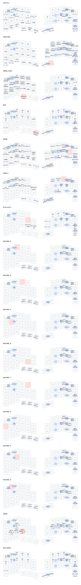

◆══════════════════════════════════════◆

# << RELEASE RECOLLECTION >>

*記憶解放 — ZMK Firmware System Interface*

◆══════════════════════════════════════◆

> **[ SYSTEM ANNOUNCEMENT ]**
> 記憶は消えない。剣技は身体に刻まれている。
> トラックボールが軌跡を描いた瞬間、封じられた技が解放される。
> ── System Call, Enhance Armament. Release Recollection.

══════════════════════════════════════════════

## ◆ KEYMAP DISPLAY ── キーマップ図

> [ CARDINAL ] Push のたびに自動更新されます（`.github/workflows/draw-keymap.yml`）



══════════════════════════════════════════════

## ◆ CARDINAL EDITOR ── 記憶書換術式

*管理者権限を以て神器の記憶を直接書き換える Web 術式。ブラウザ上で `keymap.yaml` のキーを視覚編集し、`config/` 以下の DTS / YAML / overlay / conf を全域編纂し、〈Sealing〉により GitHub へ一括封印（コミット）する。*

> **[ CARDINAL ]** 〈Cardinal Editor〉は静的サイトとして `editor/` 配下に構築されている。GitHub API + Tree API を直接叩いて複数ファイルを 1 コミットで送信する設計。

### ◆ 〈Live Sync Conduit〉── 直接接続術式（Phase 2 / PoC）

`editor/live.html` で **公式 ZMK Studio と同じ Web Bluetooth プロトコル**による直接接続を実現する PoC。`@zmkfirmware/zmk-studio-ts-client@0.0.18` を **esm.sh 経由でビルド不要に組み込み**、Service UUID `00000000-0196-6107-c967-c5cfb1c2482a` の GATT サービスへ接続する。

| 段階 | 状態 |
|---|---|
| Step 1: ZMK Studio 有効化（`CONFIG_ZMK_STUDIO=y`） | ✅ |
| Step 2: PoC（Web Bluetooth 接続 + Transport 確立） | ✅ |
| Step 3: RPC キーマップ取得・書換 + Visual Editor 同期 | ✅ |

> **[ SYSTEM ]** Live Sync Conduit を使うには Elucidator (central) に ZMK Studio 有効化版ファームウェアが書き込まれている必要がある。Chrome / Edge など Web Bluetooth API 対応ブラウザ必須。

### ◆ 起動方法 ── Invocation

#### 〈オンライン〉GitHub Pages（推奨）

`.github/workflows/deploy-editor.yml` により main ブランチの `editor/` が
自動的に GitHub Pages へデプロイされる。HTTPS なので Web Bluetooth API が
最も安定する。

| 入口 | URL |
|---|---|
| Cardinal Editor (git 編纂) | `https://cardinal-sys.github.io/Release_Recollection_Cardinal/index.html` |
| Live Sync Conduit (実機接続) | `https://cardinal-sys.github.io/Release_Recollection_Cardinal/live.html` |

> **[ SYSTEM ]** 初回利用時は GitHub の Settings → Pages で Source を
> "GitHub Actions" に設定する必要がある。

#### 〈オフライン〉launchd 常駐（macOS）

ローカルマシンに Cardinal Editor サーバを常駐させる：

```bash
# 常駐化
bash scripts/install_launchd.sh

# 解除
bash scripts/uninstall_launchd.sh
```

常駐後、`http://localhost:3001` でいつでも利用可能。
ログは `~/Library/Logs/cardinal-editor/server.log`。

#### 〈ワンショット〉手動起動

```bash
python3 scripts/cardinal_editor_server.py
# または
python3 -m http.server 3001 --directory editor
```

### ◆ 認証関門 ── Authentication Gate

GitHub Personal Access Token（`repo` スコープ必須）をブラウザに入力。トークンは localStorage にのみ保存され、GitHub API の Bearer 認証に使用される。

### ◆ 編纂対象 ── Editable Modules

| 領域 | ファイル |
|---|---|
| キーマップ描画 | `keymap.yaml` `keymap_drawer.yaml` |
| 神器エントリ | `config/Cardinal.keymap` |
| コンボ術式 | `config/keymap/10_combos.dtsi` |
| マクロ術式 | `config/keymap/20_macros.dtsi` |
| Enhance Armament | `config/keymap/30_*` `31_*` `35_*` |
| 剣技（ジェスチャー） | `config/keymap/40_*` 〜 `47_*` |
| 階層（レイヤー） | `config/keymap/layers/*.dtsi` |
| Shield 設定 | `config/boards/shields/Cardinal/*` |
| west.yml | `config/west.yml` |

### ◆ 編纂モード ── Edit Modes

- **Code Editor** — CodeMirror による DTS / YAML 構文ハイライト + 括弧マッチング + Active Line Highlight
- **Visual Editor**（`keymap.yaml` 限定）— `config/Cardinal.json` のレイアウト座標から **左右分割の物理キーボード配置を再現**。親指列の回転（`r:`）も `transform: rotate()` で忠実に表現。レイヤー切替タブ + キーのクリック編纂で `t:` `h:` を直接書換
- **Quick Pick**（神器選択候補）— レイヤー / 修飾キー / 文字 / 数字 / F1-F24 / 矢印 / 特殊キー / 記号 / ZMK behavior / **剣技 (Sword Skills)** / 使用中の値 の 11 カテゴリから値を選択可能。剣技カテゴリには 8 神器 × 4 方向 = 32 種の `&gE_*` 〜 `&gW_*` 全 mod-morph behavior が含まれる。Tap/Hold いずれにも適用ターゲットを切替可能。`<datalist>` でオートコンプリートも併設
- **Modifier Toggles**（修飾キー独立選択）— `Sft` / `Ctl` / `Alt` / `Gui` をチップ式チェックボックスで個別トグル。選択状態は対象フィールド（Tap / Hold）の値に **`Sft+Ctl+TAB` 形式で自動結合**される。既存値の修飾キープレフィックスもパースして UI に反映、双方向同期

### ◆ 封印術式 ── Sealing Protocol

複数ファイル変更を 1 コミットで送信する Tree API 連鎖：

1. ブランチ ref → base commit → base tree を取得
2. 変更ファイルごとに Blob 生成
3. 新規 Tree を作成（base_tree からの差分）
4. 新規 Commit を作成（parent = base commit）
5. ブランチ ref を新 Commit へ更新

> **[ SYSTEM ]** 〈Sealing〉は確認ダイアログを経由する。誤封印を防ぐカーディナル安全装置。

══════════════════════════════════════════════

## ◆ SYNTHESIS REGISTRY ── レイヤー構成

*カーディナルシステムにより展開されたシンセシス一覧。アクティブなシンセシスは STATUS CRYSTAL が示す。*

| SYNTHESIS | NAME | DESCRIPTION |
|---|---|---|
| [ Synthesis 00 ] | default | 通常入力 |
| [ Synthesis 01 ] | FUNCTION | ファンクションキー・カーソル |
| [ Synthesis 02 ] | SIGN | 記号入力（括弧・引用符・各種記号）|
| [ Synthesis 03 ] | NUM | 右手テンキー / 左手は編集ショートカット（⌘A/X/C/V/Z/Y, ^⌥V, ⌘↑3, ⌘↑4, END）|
| [ Synthesis 04 ] | MOUSE | マウス操作 |
| [ Synthesis 05 ] | SCROLL | スクロール |
| [ Synthesis 06 ] | Bluetooth | BT接続切替・bootloader |
| [ Synthesis 07 ] | GESTURE_E | ジェスチャー（E キー長押し）|
| [ Synthesis 08 ] | GESTURE_R | ジェスチャー（R キー長押し）|
| [ Synthesis 09 ] | GESTURE_S | ジェスチャー（S キー長押し）|
| [ Synthesis 10 ] | GESTURE_B | ジェスチャー（B キー長押し）|
| [ Synthesis 11 ] | GESTURE_T | ジェスチャー（T キー長押し）|
| [ Synthesis 12 ] | GESTURE_A | ジェスチャー（A キー長押し）|
| [ Synthesis 13 ] | GESTURE_D | ジェスチャー（D キー長押し）|
| [ Synthesis 14 ] | GESTURE_W | ジェスチャー（W キー長押し）|
| [ Synthesis 15 ] | SNIPE | スマートスネイプ（Tab ホールド or L2+L3 同時ホールドで起動。デフォルトと同一バインド、CPI 自動低減。クリック・キー入力で自動解除。**K ホールド中はトラックボールがスクロールホイールに変換される**）|
| [ Synthesis 16 ] | NUM_SMART | スマート数字入力（数字キーで自動維持） |

══════════════════════════════════════════════

## ◆ ENHANCE ARMAMENT ── 武装完全支配術

*神器に宿る記憶を辿り、武装の挙動と形態を支配する下位術式。〈Release Recollection〉が神器の真名そのものを解き放つ最上位術式であるのに対し、〈Enhance Armament〉はその挙動を細部まで支配する基盤術式群を司る。*

> **[ CARDINAL ]** 武装制御系 behavior の責務分割。`config/keymap/` 以下に術式階位ごと分離されている。

### ◆ 術式階位 ── Arts Hierarchy

| 階位 | 術式名 | 役割 |
|---|---|---|
| 上位 | **Release Recollection**（記憶解放術）| 神器の真名 ─ keymap entry point。全シンセシスを統括する最上位術式 |
| 下位 | **Enhance Armament**（武装完全支配術）| 武装の挙動制御 ─ 基礎behavior／階層behavior／拡張behavior の三系統で構成 |

### ◆ 術式構成ファイル ── Sacred Modules

| ファイル | 階層 | 担う術式 |
|---|---|---|
| `config/keymap/30_enhance_armament_base.dtsi` | 基礎術式 | hold-tap / sensor-rotate / sticky-key / tri-state（神器の根源挙動） |
| `config/keymap/31_enhance_armament_layers.dtsi` | 階層術式 | レイヤー制御behavior / auto-layer（神器の階層遷移） |
| `config/keymap/35_enhance_armament.dtsi` | 拡張術式 | 拡張behaviorの依代。将来の昇華に備えた予約領域 |

> **[ SYSTEM ]** 拡張術式ファイル `35_enhance_armament.dtsi` は現時点で空。新規導入する武器制御術式はこの依代に記される。

══════════════════════════════════════════════

## ◆ KEYSTROKE MECHANICS ── 操作感チューニング

*〈Enhance Armament〉基礎術式の調律。フラクトライトの応答特性を制御する hold-tap behavior。誤入力を防ぎながら意図した長押しを正確に認識する。*

### Hold-Tap Behavior Matrix

*各 behavior の設定は、双剣運用時の誤入力抑制と素早い反応のバランスを取っている。*

| Behavior | flavor | tapping-term-ms | quick-tap-ms | require-prior-idle-ms | hold-trigger-key-positions | 役割 |
|---|---|---|---|---|---|---|
| `gesture_mo_kp` | tap-preferred | 210 | 150 | 450 | — | ジェスチャーレイヤー（E,R,S,D,W等の長押し） |

──────────────────────────────────────────────

## ◆ SWORD SKILLS ── ジェスチャーマッピング表

*剣技は身体の記憶に刻まれている。対応キーを**長押ししながらセンサーを動かした瞬間**、技が解放される。*
*上下左右 4 方向を認識。Shift 同時押しで上位技へと昇華する。*

──────────────────────────────────────────────

### ◆ SWORD SKILL : SHARP NAIL  [ KEY : E ] ── GESTURE_E（E キー長押し）― 編集剣技

*素早い連続斬撃。コピー・カット・ペーストを一息に刻み込む。*

| 方向 | 通常 | Shift 同時押し |
|---|---|---|
| ↑ 上 | `Cmd+C` コピー | `Cmd+X` カット |
| ↓ 下 | `Cmd+V` ペースト | `Cmd+Shift+V` フォーマットなしペースト |
| ← 左 | `Cmd+Z` アンドゥ | `Cmd+P` |
| → 右 | `Cmd+Shift+Z` リドゥ | `Cmd+Return` |

──────────────────────────────────────────────

### ◆ SWORD SKILL : VORPAL STRIKE  [ KEY : R ] ── GESTURE_R（R キー長押し）― 選択剣技

*渾身の一撃でテキストを貫く。精密な範囲指定を一刀両断する。*

| 方向 | 通常 | Shift 同時押し |
|---|---|---|
| ↑ 上 | `Cmd+A` 全選択 | `Cmd+Shift+↑` |
| ↓ 下 | `Cmd+X` カット | `Cmd+Shift+↓` |
| ← 左 | `Alt+Shift+←` 単語選択（左） | `Cmd+Shift+←` 行頭まで選択 |
| → 右 | `Alt+Shift+→` 単語選択（右） | `Cmd+Shift+→` 行末まで選択 |

──────────────────────────────────────────────

### ◆ SWORD SKILL : THE ECLIPSE  [ KEY : S ] ── GESTURE_S（S キー長押し）― 捕捉剣技

*全てを覆い封じる最終奥義。画面そのものを闇に刻み込む。*

| 方向 | 通常 | Shift 同時押し |
|---|---|---|
| ↑ 上 | `Cmd+Shift+3` 全画面スクショ（ファイル保存） | `Ctrl+Cmd+Shift+3` 全画面（クリップボード） |
| ↓ 下 | `Escape` | `Escape` |
| ← 左 | `Cmd+Shift+4` 範囲選択スクショ | `Ctrl+Cmd+Shift+4` 範囲選択（クリップボード） |
| → 右 | `Cmd+Shift+5` スクショメニュー | `Cmd+Shift+5` |

──────────────────────────────────────────────

### ◆ SWORD SKILL : HOWLING OCTAVE  [ KEY : B ] ── GESTURE_B（B キー長押し）― 音響剣技

*8連の咆哮が空間を震わせる。輝度と音量を意のままに操る。*

| 方向 | 通常 | Shift 同時押し |
|---|---|---|
| ↑ 上 | 輝度上げる | `F13` |
| ↓ 下 | 輝度下げる | ミュート |
| ← 左 | 音量下げる | `F19` |
| → 右 | 音量上げる | `F18` |

──────────────────────────────────────────────

### ◆ SWORD SKILL : SONIC LEAP  [ KEY : T ] ── GESTURE_T（T キー長押し）― 航路剣技

*音速で次の場所へ跳躍する。タブという扉を瞬時に開閉する。*

| 方向 | 通常 | Shift 同時押し |
|---|---|---|
| ↑ 上 | `Cmd+T` 新規タブ | `Cmd+R` リロード |
| ↓ 下 | `Cmd+W` タブを閉じる | `Cmd+F` 検索 |
| ← 左 | `Ctrl+Shift+Tab` 前のタブ | `Cmd+-` ズームアウト |
| → 右 | `Ctrl+Tab` 次のタブ | `Cmd++` ズームイン |

──────────────────────────────────────────────

### ◆ SWORD SKILL : VERTICAL SQUARE  [ KEY : A ] ── GESTURE_A（A キー長押し）― 探索剣技

*四方を刻む連続剣技。アプリの格子を縦横に切り裂き、目標へ飛ぶ。*

| 方向 | 通常 | Shift 同時押し |
|---|---|---|
| ↑ 上 | `Ctrl+B` | `Ctrl+Alt+Cmd+1` |
| ↓ 下 | `Cmd+Space` Spotlight | `Ctrl+Alt+Cmd+4` |
| ← 左 | `Cmd+Shift+Tab` アプリ切替（前） | `Ctrl+Alt+Cmd+3` |
| → 右 | `Cmd+Tab` アプリ切替（次） | `Ctrl+Alt+Cmd+2` |

──────────────────────────────────────────────

### ◆ SWORD SKILL : STARBURST STREAM  [ KEY : D ] ── GESTURE_D（D キー長押し）― 空間剣技

*16連の星屑が全方位を薙ぎ払う。Mission Control で全シンセシスを一望する。*

| 方向 | 通常 | Shift 同時押し |
|---|---|---|
| ↑ 上 | `Ctrl+↑` Mission Control | `F12` |
| ↓ 下 | `Cmd+H` ウィンドウを隠す | `Ctrl+↓` |
| ← 左 | `F14` | `F11` |
| → 右 | `F15` | `F20` |

──────────────────────────────────────────────

### ◆ SWORD SKILL : HORIZONTAL  [ KEY : W ] ── GESTURE_W（W キー長押し）― 踏破剣技

*水平に薙ぐ一閃。左右に刻まれた履歴の軌跡を自在に辿る。*

| 方向 | 通常 | Shift 同時押し |
|---|---|---|
| ↑ 上 | `F3` ウィンドウを最大化　| `F17` |
| ↓ 下 | `Cmd+M` ウィンドウを最小化 | `F11` |
| ← 左 | `Cmd+[` ブラウザ戻る | `Cmd+Q` アプリ終了 |
| → 右 | `Cmd+]` ブラウザ進む | `Cmd+W` タブ/ウィンドウを閉じる |

══════════════════════════════════════════════

## ◆ MOVEMENT PARAMETERS ── トラックボール → キー変換（アロープロファイル）

*特定のシンセシスでは、トラックボールの動きがキー入力へと変換される。剣技とは独立した力で、**動かし続ける限り連続入力**される。*

### ◆ PRIMARY FORMATION ── 通常プロファイル（arrows-profiles）

| SYNTHESIS | 上 | 下 | 左 | 右 | one_shot | 備考 |
|---|---|---|---|---|---|---|
| 2 SIGN | 選択↑ | 選択↓ | 選択← | 選択→ | なし | 自動リピートなし |
| 3 NUM | `↑` | `↓` | `←` | `→` | なし | 加速あり |
| 6 Bluetooth | `強制終了(Cmd+Opt+Esc)` | `画面ロック(Ctrl+Cmd+Q)` | `LANG2(英数)` | `LANG1(かな)` | あり | 斜め無効・余り有効 |

### ◆ ALT FORMATION ── Shift 同時押し or arrows_alt 起動時（arrows-alt-profiles）

| SYNTHESIS | 上 | 下 | 左 | 右 | one_shot |
|---|---|---|---|---|---|
| 15 SNIPE | `SCROLL_UP` | `SCROLL_DOWN` | `SCROLL_LEFT` | `SCROLL_RIGHT` | なし |
| 2 SIGN | `Cmd+A` | `Cmd+V` | `Cmd+X` | `Cmd+C` | あり |
| 3 NUM | `Undo` | `Redo` | `BS` | `Del` | あり |
| 6 Bluetooth | 再生/停止(`C_PP`) | 停止(`C_STOP`) | 前のトラック(`C_PREV`) | 次のトラック(`C_NEXT`) | なし |

> **[ SYSTEM ]** L15 はキーバインドではなく `&ht_arrows_alt 15 K`（K ホールド）で起動。ドライバ拡張コード `2000-2003` が `input_report_rel(REL_WHEEL/REL_HWHEEL)` を直接発行するためホスト側はマウスホイールとして認識する。

> **[ SYSTEM ]** **one_shot** — 有効時、センサーの動きに対してキーが 1 度だけ送出される。
> 押しっぱなし状態にはならない。連続入力が不要な操作に適用される。

### ◆ ACCELERATION SYSTEM ── 加速設定（Synthesis 03）

- 閾値を超えると最大 1/4 速度まで加速
- 初回入力から 250ms 後に連続入力開始、100ms 間隔でリピート

══════════════════════════════════════════════

## ◆ STATUS CRYSTAL REGISTRY ── LED カラー（シンセシスインジケーター）

*アクティブなシンセシスに応じてクリスタルの発光色が変化する。現在位置をフラクトライトに知らせるインジケーター。*

| SYNTHESIS | COLOR |
|---|---|
| 0 default | 0 |
| 1 FUNCTION | 1 |
| 2 SIGN | 2 |
| 3 NUM | 3 |
| 4 MOUSE | 4 |
| 5 SCROLL | 5 |
| 6 Bluetooth | 6 |
| 7 GESTURE_E | 3 |
| 8 GESTURE_R | 4 |
| 9 GESTURE_S | 5 |
| 10 GESTURE_B | 0 |
| 11 GESTURE_T | 6 |
| 12 GESTURE_A | 7 |
| 13 GESTURE_D | 1 |
| 14 GESTURE_W | 2 |
| 15 SNIPE | 7 |
| 16 NUM_SMART | 3 |

══════════════════════════════════════════════

## ◆ EQUIPPED MODULES ── 依存モジュール

*このシステムを支える仲間たち。一つでも欠ければ、剣技は発動しない。*

| MODULE | REPOSITORY | DESCRIPTION |
|---|---|---|
| zmk | zmkfirmware/zmk | ZMK 本体 |
| zmk-pmw3610-driver | cardinal-sys/zmk-pmw3610-driver | PMW3610 トラックボールドライバー |
| zmk-listeners | ssbb/zmk-listeners | レイヤーリスナー |
| zmk-mouse-gesture | cardinal-sys/zmk-mouse-gesture | マウスジェスチャー認識 |
| zmk-scroll-snap | kot149/zmk-scroll-snap | スクロール軸スナップ（X/Y軸整列） |
| zmk-rgbled-widget | caksoylar/zmk-rgbled-widget | RGB LED インジケーター |
| zmk-pointing-acceleration-alpha | nuovotaka/zmk-pointing-acceleration-alpha | ポインタ加速度 |
| zmk-behavior-insomnia | badjeff/zmk-behavior-insomnia | BLE 接続中スリープ防止 |
| zmk-tri-state | urob/zmk-tri-state | アプリ切替スワッパー |
| zmk-auto-layer | urob/zmk-auto-layer | Smart Num（数字入力で自動レイヤー維持） |
| zmk-helpers | urob/zmk-helpers | キーマップ記述ヘルパーマクロ |

══════════════════════════════════════════════

## ◆ CHARACTER PARAMETERS ── 設定値サマリー

*フラクトライトの稼働を支える各種パラメータ。数値一つが安定と崩壊を分ける。*

### NERVE LINK STABILITY ── BLE・接続安定性

*STL とホストを繋ぐ生命線。接続が切れれば、フラクトライトは消滅する。*

| 設定 | 値 | 対象 | 効果 |
|---|---|---|---|
| Experimental Conn | R・L両側で無効 | ― | `CONFIG_ZMK_BLE_EXPERIMENTAL_CONN` は 2026-05-31 に撤去済み。なお ZMK 上流での唯一の効果は 2M PHY の既定無効化 (`app/Kconfig`: `config BT_CTLR_PHY_2M / default n if ZMK_BLE_EXPERIMENTAL_CONN`) であり、本構成は `CONFIG_BT_CTLR_PHY_2M=y` を明示指定しているため、撤去の前後で実際のビルド結果は不変だった |
| NFCT_PINS_AS_GPIOS | 有効 | R・L両側 | NFC無線とBLEの干渉防止（安定版2つともあり） |
| BT_GAP_AUTO_UPDATE_CONN_PARAMS | 有効 | R・L両側 | 接続後に自動パラメータ再交渉（kabutokoma準拠） |
| BT_CONN_PARAM_UPDATE_TIMEOUT | 1000ms | R・L両側 | 接続から1秒後にパラメータ更新要求 |
| BT_PERIPHERAL_PREF_TIMEOUT | 未設定（Zephyr既定） | R・L両側 | ホスト向け supervision timeout。従来 1000（10秒、Apple上限6秒を超過）だったが、〈Timeout Sigil Removal〉（2026-09-11）で設定ごと撤去し既定値へ委ねる実験中。「両方動いていた」原型 Cygnus-S-Lkeymouse にはこの設定自体が存在しない |
| TX Power | +8dBm | R・L両側 | 最大送信出力 |
| Split BLE Latency | 0 | R側（Central） | デフォルト 30 から 0 へ変更（Left 側キー入力の遅延パケット許容をゼロに） |
| Split BLE Timeout | 1000 | R・L両側 | スプリット接続タイムアウト（両側共通） |
| BT Max Conn | 6 | R・L両側 | 5プロファイル + 1スプリット接続（ZMK upstream の split central 既定値） |
| BT Max Paired | 6 | R・L両側 | `ZMK_BLE_PROFILE_COUNT = BT_MAX_PAIRED - PERIPHERALS = 6 - 1 = 5` で profile 0..4 全 5 枠を有効化 |
| BT_PERIPHERAL_PREF_MIN_INT | 6 (7.5ms) | R・L両側 | 接続インターバル下限 (Win/Android 最速側で 7.5ms 交渉) |
| BT_PERIPHERAL_PREF_MAX_INT | 12 (15ms) | R・L両側 | 接続インターバル上限 (Apple HID 互換上限。`MIN_INT=6` との範囲指定で macOS/iPadOS/iOS から最低 15ms を引き出す。L側もR側と同期) |
| Insomnia pingInterval | 3秒 | R・L両側 | keepaliveを高頻度化（L側にも追加） |

### MOTION SENSOR CONFIG ── トラックボールセンサー（Elucidator.conf）

*センサーの挙動を制御するパラメータ。省電力モードへの移行速度を調整する。*

| 設定 | 値 | 効果 |
|---|---|---|
| PMW3610 REST移行時間 | 3000ms | RUN モード維持を延長し、短時間アイドル復帰の遅延を抑制 |
| PMW3610 REST1 サンプル間隔 | 10ms | REST 中のサンプリング間隔を半減し、復帰時の応答を改善 |
| PMW3610 ポーリングレート | 125Hz (POLLING_RATE_125) | 起動遅延を削除しポーリングレート固定モードに変更。**センサー側は据え置き**（250Hz 化は電流・SPI 倍増のため無線機では選ばない） |
| PMW3610 2サンプル蓄積 | `no-sample-accumulation`（無効化） | 〈Accumulation Gate〉。蓄積は `POLLING_RATE_250` 前提で書かれた処理で、125Hz と併用するとレポートが 62.5Hz (16ms) まで二重に半減し 60Hz ディスプレイ (16.67ms) とうなる。停止するとレポート周期のみ 8ms へ戻る（センサー電流は不変、増えるのは HID 通知頻度だけ） |
| PMW3610 force-awake | 有効 | スリープ移行を抑制し、起動遅延ゼロを維持 |
| PMW3610 4ms モード | **無効**（削除済み） | BLE 7.5ms インターバルとのミスマッチによるポインタジャンプを防止 |
| PMW3610 IIR フィルタ | `iir-filter-alpha = <1024>`（α=1.0 = 無効） | 〈Filter Bypass〉。既定 614 (α≈0.6) は整数切り捨てで低速域のカウントを落とし、`filtered_x/y` が init 以外でリセットされないため停止後の再始動に残響が混じる。カクツキ切り分けの単一変数実験として恒等写像化 |
| PMW3610 CPI | 2200 | 通常カーソル CPI（`pointer_accel.sensor-dpi` は実態 **800**。後述の〈Accel Preset Override〉参照）。SNIPE 中はドライバが自動低減 |
| PMW3610 cpi-layers | `<4 3200>` | L4 MOUSE アクティブ時はセンサー CPI を 3200 に動的切替（〈Resolution Shift〉) |
| arrows-alt L15 tick | 80ms | K ホールドスクロールの精密度。値が大きいほど 1 ノッチが大きい動きを要求 |
| L5 SCROLL スケーラー | `1/1`（1x = 等速） | `zip_xy_to_scroll_mapper` 後段に `zip_snipe_scroll_scaler 1 1` を噛ませる現状は等速。`<1 2>` に変更すれば半速精密化に再昇華可能 |

### ROTARY SIGIL ── EC11 ロータリーエンコーダー（Dark_Repulser / Cardinal.dtsi）

*漆黒の反逆者の柄に宿る回転の印。一刻みが一拍と同調してこそ、術式は正しく廻る。*

| 設定 | 値 | 効果 |
|---|---|---|
| EC11 steps | 48 | 1 回転あたりの quadrature パルス数（素体 Cygnus `a6429bb` 準拠。旧 12 はパルス数過小で 1 クリックが過剰トリガー化） |
| triggers-per-rotation | 24 | 1 回転あたりのキーマップトリガー数。`48 / 24 = 2 steps/trigger` で 1 デテント = 1 トリガーに正規化 |

### THREAD STACK ── スレッドスタック（クラッシュ対策）

*システムの安定を支える根幹。スタックが尽きればフラクトライトは瞬く間に崩壊する。*

| 設定 | 値 | 対象 | 備考 |
|---|---|---|---|
| EC11スレッド | 4096 bytes | Dark_Repulser | |

══════════════════════════════════════════════

## ◆ INITIALIZATION PROTOCOL ── ビルド

*STL 起動。カーディナルシステムが世界を再生成する。*

> **[ CARDINAL ]** GitHub Actions により自動ビルド（`.github/workflows/build.yml`）。
> Push を契機に自動実行される。Artifacts から `.uf2` ファイルをダウンロードし、デバイスへ書き込むことで起動が完了する。

══════════════════════════════════════════════

## ◆ SYSTEM LOG ── 更新履歴

*カーディナルシステムの変更軌跡。刻まれた決定と解放された力の記録。*

| DATE | ENTRY |
|---|---|
| 2026-09-11 | 〈Timeout Sigil Removal · Apple Compliance Retrial〉— **実機未検証、単一変数実験。** iPadOS で2個目以降のプロファイルが「一度は繋がるがすぐ切断される」症状の切り分け。`CONFIG_BT_PERIPHERAL_PREF_TIMEOUT=1000`（10秒）は Apple Accessory Design Guidelines の supervision timeout ≤ 6秒に違反しており、2026-08-02〈Supervision Timeout Resealing〉で 600（6秒）への単独差し替えを試みたが実機で切断解消を確認できず、同日〈Resealing Withdrawal〉で 1000 へ差し戻されていた。今回、原型 `cardinal-sys/Cygnus-S-Lkeymouse`（Mac・複数プロファイルペアリングとも正常に動いていたと報告あり）の `KeyballBLE_L/R.conf` を確認したところ、`BT_PERIPHERAL_PREF_TIMEOUT` を含む BLE チューニング一式（`BT_CTLR_PHY_2M`／`BT_CTLR_TX_PWR_PLUS_8`／`BT_CTLR_DATA_LENGTH_MAX`／`BT_BUF_ACL_TX_COUNT`等）が**一切存在しない**（Zephyr既定に委ねている）ことが判明。以前の実験は「600 という値」を試しただけで「設定を撤去してZephyr既定に委ねる」という原型と同じ状態は未検証だったため、`Elucidator.conf`/`Dark_Repulser.conf` の `CONFIG_BT_PERIPHERAL_PREF_TIMEOUT` 行を撤去（コメントアウト）し、原型と同じ既定挙動に戻す。`MIN_INT`/`MAX_INT`（Apple向けカクツキ対策、2026-05-26〈Apple HID Interval Compat〉導入）は今回は変更していない ―― `MIN_INT` を Apple 要求の 15ms まで引き上げると Win/Android の 7.5ms 最速交渉が犠牲になり、`MAX_INT` を連動して緩めるとカクツキ対策そのものが後退するトレードオフがあるため、まずは影響範囲の狭い timeout 単独で切り分ける。`fix/ble-peripheral-timeout-default` ブランチで PR化、GHA build 通過後に実機（iPadOS 複数プロファイル）検証を経て main マージ判断。 |
| 2026-08-06 | 〈Lens Purification · Judder Resolved〉— **カクツキの真因はレンズの汚損だった。清掃により解消。** ファームウェアの変更は一切不要だった。**記録として残す価値のある誤診の系譜**: 本件は「新しいビルドを焼いた直後に症状が出た」という時間的近接から始まり、①直近コミット群と上流差分 → ②BLE 転送路 → ③IIR フィルタ → ④レポート周期 62.5Hz の順に容疑をかけ、**四つとも実機検証で棄却された**。決定的な観測は早い段階で揃っていた ―― **ポインタ経路のコードと設定は 2 ヶ月間 1 行も動いていない**（driver pin `35f2c40` は 2026-05-21 以降不動、`Elucidator.overlay` は 2026-05-25 以降無変更、直近の west ピン留めは上流差分ごと無罪と実証）にもかかわらず症状は新しく、かつ**有線接続でも同一**だった。「変化していない系から新しい症状は出ない」以上、変わったのはキーボードの外 ―― この推論は初回の調査時点で提示していたが、ホスト OS 更新という別の「外側の変化」が判明したことで容疑がそちらへ引きずられ、物理検証が後回しになった。**教訓**: 転送路非依存（有線でも再現）かつコード不変の症状に対しては、ソフトウェア側の仮説を積む前に物理経路（レンズ・ボール・軸受の表面品質）を潰すべきだった。PMW3610 は表面品質が落ちるとモーション検出を取りこぼし、欠落したポーリングでカーソルが停止して次のサンプルで追いつく ―― これはカクツキそのものであり、レポート周期にも転送路にも依存しない。**なお本調査で発見した二件の実在バグ**（〈Filter Bypass〉= IIR の整数切り捨て損失と状態残留、〈Accumulation Gate〉= 250Hz 前提の 2 サンプル蓄積が `POLLING_RATE_125` の上に残置され誰も意図しない 62.5Hz を生んでいた二重半減）は**症状とは無関係に実在する**ため、対症療法としてではなく設計意図との乖離の是正として別途処理する。 |
| 2026-08-06 | 〈Accumulation Gate · Report Rate Restoration〉— **結論を先に記す: 本変更はカクツキを解消しなかった。** 実機検証で症状は不変であり、下記の「62.5Hz うなり」仮説は**棄却された**。それでも本変更を温存するのは、**症状とは独立に「意図されていない二重半減」という実在の欠陥を正すため**である（症状の対症療法としてではなく、設計意図との乖離の是正として残す）。当初は**ホスト OS 更新が引き金と判明**したため（ファーム側のポインタ経路は 2 ヶ月不動・症状は新しい・有線でも同一 ―― 三点全てが「変わったのはキーボードの外」を指す）、これまでホスト側の平滑が覆い隠していた **62.5Hz レポートの構造的うなり**が表面化したと判断。**機序**: レポート周期 16ms と 60Hz ディスプレイ 16.67ms のうなりにより周期 ≈400ms（毎秒 2.5 回）で 1 フレーム分カーソルが凍る。62.5Hz の出所は**半減の二重掛け** ―― `CONFIG_PMW3610_ALT_POLLING_RATE_125`（センサー PERFORMANCE レジスタ 0x00、8ms/sample）に加え、`pmw3610.c` の 2 サンプル蓄積が更に半減させる。後者は `3dec0223` が **250Hz** ポーリング前提で書いた処理で、無条件実行・Kconfig も DT ゲートも無いまま 125Hz の上に残置されていた。**採らなかった道**: `POLLING_RATE_250` への引き上げはセンサー電流と SPI 転送を倍にするため無線機では選べない（ドライバ Kconfig help 自身が 125Hz を電力・BLE 安定性の推奨としており、README 既存行「PMW3610 4ms モード無効」とも整合）。**採った道**: ドライバに `no-sample-accumulation`（boolean、未指定時は従来通り蓄積 = 後方互換）を新設し、**センサー側を据え置いたままレポート周期のみ 16ms → 8ms へ戻す**。増えるのは HID 通知頻度だけで、15ms の接続イベントあたり通知 1 → 2 は DLE 251 / 2M PHY / `BT_BUF_ACL_TX_COUNT=10` に十分収まる。**重要な結合**: 1 レポートあたりの delta が半減するため `iir-filter-alpha` 既定 614 の整数切り捨て損失が相対的に増大し、delta=1 が出力 0 の恒久デッドゾーンに落ちる ―― **本変更は〈Filter Bypass〉(`iir-filter-alpha = <1024>`) と必ず併用すること**。両者は独立した実験にできない。`config/west.yml` の driver revision は `35f2c40` → **`47db819`**（`cardinal-sys/zmk-pmw3610-driver` PR #1 のマージコミット）へ更新。検証中に用いていた feature ブランチ先端への暫定ピン `23dfac5` は張り替え済みで、〈Known-Good Anchor〉〈Zephyr Anchor〉の「浮動参照を残さない」方針は維持されている。**実機検証の結果と残る容疑**: 本変更（レポート 16ms → 8ms）でも症状は不変。併せて〈Filter Bypass〉単独でも不変。これにより「直近コミット群 / 上流」「BLE 転送路（有線でも同一）」「IIR フィルタ」「レポート周期 62.5Hz」「加速術式の乖離」の 5 経路が全て棄却され、**キーボード側の容疑はほぼ尽きた**。残るのは①物理（ボール・レンズ・軸受の汚損による表面品質低下 → モーション検出の取りこぼし）と②ホスト側（OS 更新後のポインタ処理変更）の二つで、いずれも本リポジトリの外にある。切り分けは「同一ホストに別のポインティングデバイスを繋ぐ」（それもカクつけばホスト側で確定）が最短。`feat/report-rate-restoration` ブランチで PR 化。 |
| 2026-08-06 | 〈Filter Bypass · Judder Triage〉— **結論を先に記す: 本変更はカクツキを解消しなかった**（実機検証で症状は不変）。温存するのは、以下に記す IIR の切り捨て損失と状態残留が**症状とは独立に実在するバグ**であり、かつ〈Accumulation Gate〉の前提条件（レポートあたり delta が半減するため切り捨て損失が相対的に増大する）だからである。以下は当時の追跡記録。ポインタのカクツキ追跡。`Elucidator.overlay` の `trackball` ノードに **`iir-filter-alpha = <1024>`** を 1 行追加し、IIR フィルタを恒等写像に落とす**単一変数実験**。**切り分けの経緯**: ①直近コミット群（〈Known-Good Anchor〉〈Zephyr Anchor〉）は無罪と実証 ―― zmk `ff09f2d`→`main` の 40 コミットは docs/dependabot と keymap null 参照修正・studio 保存修正のみ、zephyr `58a5874a`→`9df4b12b` は 2 件（`pm/device.h` の revert、ls0xx SPI 修正）で、いずれもポインタ経路に触れていない。ドライバ pin `35f2c40` は 2026-05-21 以降不動、`Elucidator.overlay` も 2026-05-25 以降無変更で、**ポインタ経路は 2 ヶ月間 1 行も動いていない**。②当初は「HID レポート 16ms (62.5Hz) と BLE 接続イベント 15ms のうなり」を疑ったが、**有線接続でも症状が不変**との実機報告により転送路説は棄却。残る機序は「レポート生成 16ms と 60Hz ディスプレイ 16.67ms のうなり（周期 ≈400ms、毎秒 2.5 回 1 フレーム分カーソルが凍る）」であり、これは転送路に依存しない。③62.5Hz の出所は**半減の二重掛け** ―― `CONFIG_PMW3610_ALT_POLLING_RATE_125`（センサ PERFORMANCE レジスタ 0x00、8ms/sample）に加え、`pmw3610.c:1212-1225` の 2 サンプル蓄積（無条件実行、Kconfig も DT ゲートも無し）が更に半減させる。後者は `3dec0223` で **250Hz** ポーリング前提に書かれた装置が 125Hz の上に残置されたもの。**`POLLING_RATE_250` への引き上げは無線機では選べない**ため却下（ドライバ Kconfig help 自身が「125 Hz reduces power consumption and can improve BLE connection stability」と明記、README 既存行「PMW3610 4ms モード無効」とも整合）。**本コミットの標的**: 上記うなりを消すには至らないが、それを「ぬるっとした揺らぎ」に化けさせている IIR を外す。既定 `alpha=614` (α≈0.6) は `new = (x*α + prev*(1-α))/1024` の整数除算で余りをキャリーしないため、レポートあたり delta=2 で出力 1（50% 喪失）、delta=1 で出力 0（恒久デッドゾーン）と低速域を系統的に削る。加えて `filtered_x/y` は `pmw3610.c:1370` の init でしか 0 に戻らず、停止後の再始動に古い残響が 40% 混入する ―― **本 SYSTEM LOG 〈Apple HID Interval Compat〉(2026-05-26) が「根本原因は別所（IIR フィルタの状態累積 or Apple 側の独自挙動）の可能性が残る」と書き残した容疑を、コードで裏取りした形**。電力・BLE 帯域のコストはゼロ、副作用が出れば 1 行削除で原状復帰。**併せて発見（本コミットでは未修正）**: `accel_device_init.c:96-102` は `CONFIG_INPUT_PROCESSOR_ACCEL_PRESET_CUSTOM` 以外の preset 選択時に DT 値を preset で**上書き**する。本構成は `PRESET_HIGH_SENS_TRACKBALL=y` のため `Elucidator.overlay` の `&pointer_accel` ブロック（sensitivity 1000 / max-factor 16000 / exponent 3 / sensor-dpi 2200）は**一切効いておらず**、実際は preset 値（sensitivity 1400 / max-factor 2600 / curve Mild / y_boost 1200 / **sensor-dpi 800**）が走っている。更に `LEVEL_SIMPLE=y` により Level 1 が選ばれ、`speed-threshold` / `speed-max` / `min-factor` / `acceleration-exponent` は構造体に存在しない。実効挙動は「ほぼ一定 1.4 倍 + 極めて緩い二次カーブ」でカクツキの主犯ではないが、宣言 DPI 800 と実センサ 2200 の乖離は latent。**別コミットで処理する**。`fix/iir-state-bypass` ブランチで PR 化、GHA build 通過後に実機検証を経て main マージ判断。 |
| 2026-08-03 | 〈Zephyr Anchor · Import Override〉— 〈Known-Good Anchor〉で取り逃していた最後の浮動参照、zephyr を #227 と同じ **`58a5874a446ace2893a196848282d271a551e512`** へ固定。**構造**: zmk の `app/west.yml` は zephyr を `revision: v4.1.0+zmk-fixes` という**ブランチ**で指しているため、zmk を SHA 固定しても zephyr だけは毎ビルド先端へ流れていた（#227=`58a5874a` に対し 2026-08-02 の実測は `9df4b12b`、差分は ls0xx ディスプレイドライバ修正と `Revert "pm: only define slots if CONFIG_PM is enabled"` の 2 件）。**対処**: west は「取り込む側の manifest 定義が取り込まれる側に優先する」ため、`config/west.yml` に同名 project `zephyr` を再定義して上書きした。`import.name-blocklist`（17 項目）は zmk 側 `ff09f2d` の内容を機械的に照合して完全一致を確認済み ―― ここが食い違うとモジュール構成が変わるため。`clone-depth: 1` は意図的に複製していない（古い SHA の浅い取得を避けるため。CI 側が `--fetch-opt=--filter=tree:0` を付けるので転送量は抑えられる）。これにより `west.yml` の浮動参照は全て消え、**同一コミットからは常に同一のファームが焼き上がる**。#227 との残差はエンコーダ `12/10`（意図的な調律のため据え置き）のみとなり、次のビルドは変数 1 つの実験として成立する。 |
| 2026-08-02 | 〈Known-Good Anchor · Upstream Pinning〉— 実機で無線動作を確認できている唯一の基準点、Build **#227**（run `27451380456` / `848fb57`）の**上流環境だけ**を再現する。**変更は 1 点のみ**: `config/west.yml` の浮動参照 3 件を #227 時点の実コミットへピン留め ―― zmk `main` → **`ff09f2d0…`**、zmk-listeners `v1` → **`c240cea`**、zmk-scroll-snap `v1` → **`1f8fc86`**（`v1` はタグではなく**ブランチ**であり、scroll-snap は #227→#228 で `1f8fc86 → dd21a0f` に黙って動いていた。差分は docs 1 件のみで犯人ではないが、再現性を壊す構造的欠陥だった）。なお当初「zephyr は zmk の `app/west.yml` 経由で決まるため zmk のピン留めで自動的に揃う」と見込んだが、**これは誤りだった** ―― 実ビルド（run `30791380741`）で zmk=`ff09f2d` / listeners=`c240cea` / scroll-snap=`1f8fc86` は狙い通り固定された一方、zephyr は `9df4b12b` のままだった。zmk 側が zephyr を `revision: v4.1.0+zmk-fixes`（**ブランチ**）で指しているため。対処は後続の〈Zephyr Anchor〉を参照。**全モジュール 3 ビルド比較の結果、#227→#228 で動いたのは zmk / zephyr / zmk-scroll-snap の 3 つとエンコーダ設定のみで、残る約 60 モジュールは完全一致**だった。**②が本質的に重要**: 浮動参照のままではリポジトリが同一コミットでもビルドの度に上流が入れ替わり、#227 の再現が原理的に不可能だった（#227=`ff09f2d` / #228=`904c9ae` / 2026-08-02 の 2 本=`aed236f5`）。**エンコーダは 12/10 のまま据え置く**（`dca3d40` の意図的な調律を尊重）。これにより本ビルドと #227 の差は「エンコーダ設定」だけになり、**変数 1 つの実験**として成立する ―― 動けば犯人は上流で確定、動かなければエンコーダ側に容疑が移る。**調査で判明した限界も記録する**: #227 と #228 のリポジトリ差分はエンコーダ数値 2 つのみで、ZMK 実装を追った限り `steps`/`triggers-per-rotation` は角度換算（`val1 = pulses * 360 / steps`、`trigger_degrees = 360 / triggers_per_rotation`）にしか使われず、初期化失敗・ゼロ除算・BLE への経路はいずれも存在しない。上流差分も docs/dependabot が大半、ビルドサイズ差は Elucidator で FLASH +136B / RAM +128B、コンパイラ警告は 3 ビルドで完全一致だった。**それでも実機では #227 のみ動作する** ―― 機序は特定できていない。以後は本アンカーを基準に、変更を 1 つずつ載せて実機検証する方針とする。 |
| 2026-08-02 | 〈Resealing Withdrawal · Cardinal Echo〉— 同日の〈Supervision Timeout Resealing〉を差し戻し、`CONFIG_BT_PERIPHERAL_PREF_TIMEOUT` を **600 → 1000** へ復帰（R・L 両側）。**理由: 実機で効果を確認できなかったため。** 600 化を焼いた後も Mac との接続は回復せず、さらに「電源スイッチを入れても LED が点灯しない」という別症状が発生した（後者は `settings_reset.uf2`（118KB、`rgbled_adapter` シールド無しのため LED ウィジェットもキーボード機能も非搭載）が基板に残置されたまま本体 uf2 が書き込まれていなかったことが原因と推定、切り分け継続中）。切り分けの変数を減らすため設定を #228 (`dca3d40`) 相当へ戻す。**なお調査で得た知見は無効化しない**: ①`BT_PERIPHERAL_PREF_TIMEOUT` の単位は 10ms（Zephyr `subsys/bluetooth/host/Kconfig.gatt`、既定 42）であり 1000 は 10 秒。Apple Accessory Design Guidelines の supervision timeout ≤ 6 秒に違反しており、`MIN_INT=6`(7.5ms) も Apple 要求の ≥ 15ms を、`MAX_INT−MIN_INT=7.5ms` も ≥ 15ms を満たさない ―― 計 3 項目の違反は事実として残る。②ZMK 標準比では `PREF_TIMEOUT` が約 24 倍、間隔が 1/4、バッファが 9 倍、TX が +8dBm と全逸脱が「速度と引き換えに余裕を削る」方向へ揃っている。③`Dark_Repulser.conf` の `CONFIG_ZMK_SPLIT_BLE_PREF_LATENCY` / `_TIMEOUT` は `if ZMK_SPLIT_ROLE_CENTRAL` の内側にしか存在せずビルド時に破棄されている（ビルドログに `was assigned the value ... but got the value ''` の警告あり）。同様に peripheral 側の `BT_MAX_CONN=6` / `BT_MAX_PAIRED=6` も ZMK 既定 (central のみ 6/6) に対し過剰。これらは無線問題が片付いた後に別件として処理する。 |
| 2026-08-02 | 〈Supervision Timeout Resealing · Apple Compliance〉— Mac とペアリング成立後に切断される事象への第一段対処。`CONFIG_BT_PERIPHERAL_PREF_TIMEOUT` を **1000 → 600** へ差し戻し（R・L 両側）。**単位の誤読が禍root**: Zephyr の定義は `"Peripheral preferred supervision timeout in 10ms units"`（`subsys/bluetooth/host/Kconfig.gatt`, 既定 42）であり、1000 は README が長らく記していた「1000ms」ではなく **10 秒**。Apple Accessory Design Guidelines は BLE アクセサリに supervision timeout **≤ 6 秒**を課すため、`CONFIG_BT_GAP_AUTO_UPDATE_CONN_PARAMS=y` により接続直後へ飛ぶ更新要求が macOS に拒否され、切断を招いていた疑いが濃い。600 = 6 秒は Apple 上限ちょうどであり、かつ本 SYSTEM LOG 〈BLE Tuning Revert〉(2026-05-01)「延長により無線接続が不安定になった問題に対応」で一度実証された既知良好値。同日の〈Timeout Re-extend〉が理由の記載なく 1000 へ戻し、〈Bilateral Sync Restoration II〉(2026-05-22) が左手側へも伝播させて封印が解けていた。**切り分け前提の単一変数修正**であり、なお不安定なら第二段として `MIN_INT 6 → 12` / `MAX_INT 12 → 24`（Apple 要求: Interval Min ≥ 15ms かつ Max ≥ Min + 15ms。現行 7.5〜15ms は二重に違反）、第三段として `CONFIG_BT_CTLR_PHY_2M=y → n` を順に検証する。**併せて判明した事実**: ファーム #227 (`848fb57`) と #228 (`dca3d40`) の差は Elucidator で FLASH +136B / RAM +128B に過ぎず、上流 zmk 10 コミット（docs / dependabot / reviung34 layout / keymap null 参照修正）・zephyr 2 コミット（ls0xx / PM ヘッダ revert）にも BLE 関連の変更は皆無で、「新ビルドで無線が壊れた」という当初の見立ては成立しない。また `3393edf`〈EXPERIMENTAL_CONN Dissolution〉は実質 no-op だった（同 Kconfig の唯一の効果は 2M PHY の**既定**無効化であり、本構成の明示 `CONFIG_BT_CTLR_PHY_2M=y` が既定に優先するため、撤去前後でビルド結果は不変）。CHARACTER PARAMETERS の該当 2 行も実態へ整合。 |
| 2026-06-13 | 〈Cygnus Resonance · Rotary Sigil Recalibration · Cardinal Echo〉— 50キー版〈Administrator〉が素体 Cygnus（[Dist16384/Cygnus-M-Lkeymouse](https://github.com/Dist16384/Cygnus-M-Lkeymouse)）の `a6429bb` を取り込んだエンコーダー再調律を、42キー版〈Cardinal〉へ双子同期。`Cardinal.dtsi` の EC11 を `steps 12 → 48` / `triggers-per-rotation 10 → 24` へ再調律。旧 12/10 は素体コピー由来で 1 トリガー = 1.2 パルスという端数比のため 1 デテントで過剰・不規則トリガーが発生し得た（配線 `xiao_d 5`/`0` は Administrator と完全一致＝同一エンコーダー部品）。48/24（2 steps/trigger）で 1 クリック = 1 トリガーに正規化され、Dark_Repulser のエンコーダーが正しい拍で廻る。なお素体の他 3 件は Cardinal でも不採用/対応不要: **BLE 6/6 固定**は Apple(iPad) 系で ≈30ms 転落リスクのため `6/12` 堅持（双子同期済の `3393edf`〈EXPERIMENTAL_CONN Dissolution · Cardinal Echo〉で iPad ペアリングは既に手当て済）、**physical layout rx 修正**は独自配列で非該当、**A/S layer-tap 撤去**は独自 gesture_mo_kp 憑依済のため対象外。これにより 42キー〈Cardinal〉と 50キー〈Administrator〉双剣のエンコーダー解像度が再び対称同調する。 |
| 2026-05-31 | 〈EXPERIMENTAL_CONN Dissolution · Cardinal Echo〉— 50キー版〈Administrator〉で iPad ペアリング不可（ボタンを押すとデバイス名ごと消える）の原因と判明した `CONFIG_ZMK_BLE_EXPERIMENTAL_CONN=y` を `Elucidator.conf` からも撤去。iPadOS の厳格な BLE スタックとの互換性問題。MacBook への影響なし（50キー版で検証済み）。 |
| 2026-05-31 | 〈Live Sync Conduit Truename Hardening · Cardinal Echo〉— 50キー版〈Administrator〉(`7db53d1`) の Live Sync シリアライザ根治を 42キー Cardinal へ予防同期。Cardinal の `config/keymap/layers/*.dtsi` は現状クリーン（mojibake・`&bt_disc_N 0`・mod-tmask 化け・生hex 化いずれも無し）だが、`editor/live.js` の `_bindingToZmk()` は Administrator と同一の潜在バグを保持しており、**次に Live Sync すると同種破損が発生する**ため先回りで封印。`editor/live.js` を 6 点修正: **(1)** `CUSTOM_BEHAVIOR_PARAMS` / `LABEL_TO_NODE` に `bt_disc_0..4`（paramCount=0）登録（ゼロセルマクロへの余分な `0` 付与防止＝ビルドエラー予防）。 **(2)** Mod-Tap 修飾を `_modMaskToZmk(p1)`（HID modifier usage `0x000700E0..E7` を modmask ビット列と誤読し `&mt LEFT_SHIFT Q` を `&mt RG(RA(RS(LEFT_CONTROL))) Q` に化けさせる）から `_p2ToKc(p1)`（`KBD_MAP[225]=LEFT_SHIFT`）へ切替。 **(3)** `_p2ToKc` に implicit modifier 保持を追加（`LG(LBKT)`→`LEFT_BRACKET` 脱落防止）。 **(4)** `KBD_MAP` に keypad（`0x53..0x63`）追加（`&kp 0x0059` 生hex化防止）。 **(5)** 既存ファイル読込の `atob()` 単体を書込側と対称な `decodeURIComponent(escape(atob()))` へ（em-dash・日本語コメントの多段文字化け防止）。 検証: Node で `_bindingToZmk`/`_p2ToKc` を mock 駆動し Mod-Tap 修飾・implicit mod・bt_disc ゼロセル・keypad・UTF-8 ラウンドトリップ 7 ケース全合格。Cardinal の dtsi は無傷のため本コミットは `live.js` + README のみ（キーマップ不変）。 |
| 2026-05-29 | 〈BT Disc Sigils Awakening · Cardinal Echo〉— 50キー版の bt_disc 再編を 42キー版に同期。`bt_disc_0..4` 新設・`bt_solo_0..4` / `bt_pair_0..4` 廃止・上段を `&bt BT_SEL 0..4` 直書きへ昇華。 |
| 2026-05-29 | 〈Full Behavior Arsenal · Twin Sync〉— Layer Editor の behavior ドロップダウンを ZMK Studio 全 behavior に拡張（50キー版と双子同期）。`&sk` / `&kt` / `&key_repeat` / `&tog` / `&to` / `&sl` / `&gresc` / `&bt` / `&out` / `&ext_power` / `&bootloader` / `&sys_reset` / `&studio_unlock` を追加。 |
| 2026-05-29 | 〈Layer Binding Rewrite · Twin Sync〉— Cardinal Editor（`editor/index.html` / `app.js`）に `layers/*.dtsi` の**選択式ビジュアルエディター**を建立（50キー版〈Administrator〉と双子同期）。`[ Layer Editor ]` ビューで物理レイアウト上のキーをクリック → behavior ドロップダウン → カテゴリ別セレクターで選択 → Apply → dtsi 書き戻し → Seal & Commit でビルド反映。合わせて **🔑 Change PAT ボタン**を追設し、PAT 期限切れ時のフォーム再表示を簡略化。 |
| 2026-05-28 | 〈BT Solo Sigils · Pure Switch · Cardinal Echo〉— Administrator 側 (`5dbc91b`) の bt_solo 簡約を 42キー Cardinal へ同期。 `bt_solo_0..4` マクロから `&bt BT_DISC` 連射を撤去し純粋な `&bt BT_SEL N`（プロファイル切替のみ）へ変更。 旧版〈Phantom Connection Banishment〉では各 `bt_solo_N` が `BT_SEL N` 直後に他 4 profile へ `BT_DISC` を連射し非アクティブ profile を強制切断していたが、**(1)** 切替のたびに他の接続中ホストまで切断する副作用、**(2)** ペアリング進行中に押すと新規 bond 確立を破壊し「2台目以降ペア不可」を招く副作用、が大きく「無線が変になった」原因となっていた。 `config/keymap/20_macros.dtsi` の `bt_solo_0..4` の `bindings` を `<&bt BT_SEL N>` 単発へ簡約（Administrator commit `5dbc91b` の差分を `git apply` でクリーン適用、BT_DISC コード全除去を確認）。 これにより `bt_solo_N` と `bt_pair_N` は等価（共に純 BT_SEL）。 双子の BT sigil が再び対称に収束。 |
| 2026-05-28 | 〈Modifier Sigil Truename Awakening · Cardinal Echo〉— Administrator 側 (`df471e2`) の Mod-Tap 修飾キー修正を 42キー Cardinal へ同期。 Cardinal Editor `live.html` の MEMORY REWRITE LIVE で「Mod-Tap binding を開くと修飾キー (ホールド時) slot の checkbox が意図と無関係な 4 modifier (例: LCtl/RSft/RAlt/RGui) に勝手にチェックが付く」症状を浄化。 原因: ZMK Studio は Mod-Tap の `param1` を **HID page-7 keyboard modifier usage** (`KBD(224..231)`) で encode するのに、`editor/live.js` の `BEHAVIOR_PARAM_SPEC['Mod-Tap'].p1.type='modmask'` + `buildModMaskSelector` が誤って modmask bitmask として解釈し `current & mask` で checkbox 状態を決めていたため、LSft (`458977=0x000700E1`) の下位バイト `0xE1` が `LCtl|RSft|RAlt|RGui` と偶発一致していた。 修正: 新型 `'hid-modifier'` を導入し Mod-Tap `p1.type` を `'modmask'`→`'hid-modifier'` へ転生、`buildHidModifierSelector` で 8 modifier を単一選択 dropdown 描画し HID usage を書き込む。 `adaptParamsForNewBehavior` は `'hid-modifier'` を `'hid'` と非互換扱いとし誤転生を封印。 dead code (`MOD_MASKS`/`buildModMaskSelector`/`case 'modmask'`) は浄化。 Administrator commit `df471e2` の live.js 差分を `git apply` でクリーン適用、`node --check` 通過。 双子の binding editor が再び対称となり、〈Memory Rewrite Live〉が Mod-Tap を真名で受理する。 |
| 2026-05-28 | 〈Bond Overwrite Sanction Revert · Cardinal Echo〉— 〈Bond Overwrite Sanction · Cardinal Echo〉(`916ec8d`) で `Elucidator.conf` へ追加した `CONFIG_ZMK_BLE_EXPERIMENTAL_SEC=y` を **revert**。 Administrator 側で SEC 有効化が **BT Secure Connection のパスキー入力**を有効にし、ペアリング時にホストへ 6 桁のパスキー番号が表示・入力を要求される挙動に変わったため（利用者の望まない方式）撤回。 Cardinal も対称に SEC フラグを撤回し従来のパスキー不要ペアリングへ復帰。 `CONFIG_ZMK_BLE_EXPERIMENTAL_CONN=y`（接続安定性）は維持。 Admin 側 revert (`afe4c1a`) と対称。 |
| 2026-05-28 | 〈Serializer Truename Hardening · Cardinal Echo〉— 50キー Administrator 側で発生した「Live Sync〈Memory Inscription〉(キーマップ→GitHub 書き戻し) が生成する dtsi が build を破壊する」根本原因を、双子の Cardinal 側へ予防同期する儀式。 Administrator では Memory Inscription が `&mouse_move`/`&bluetooth` 等のノード名・ゼロセルマクロへの余分 `0`・不正な `&bt` エンコードを全レイヤーに刻み、firmware build を停止させた (Admin `a268d73` でレイヤーをロールバック復旧)。 Cardinal の実機では今のところ Memory Inscription 未実行のためレイヤー破損は無く build は green だが、**同型 `editor/live.js` シリアライザ (`_bindingToZmk`) を共有しており、Cardinal 実機で Memory Inscription を実行すれば同じ破損が確実に発生する**ため、Administrator の恒久修正 (commit `904ed78`〈Serializer Truename Hardening〉) を予防的に echo。 修正は Administrator と**完全同一**: **(1)** `BUILTIN_NODE_TO_ZMK` マップで正規化ノード名 (`mouse_move`/`mouse_scroll`/`bluetooth`) → ラベル alias (`&mmv`/`&msc`/`&bt`) へ変換、**(2)** `app/include/dt-bindings/zmk/bt.h` の enum (`BT_CLR=0`/`BT_NXT=1`/`BT_PRV=2`/`BT_SEL=3`/`BT_CLR_ALL=4`/`BT_DISC=5`) を `BT_CMD`+`_btToZmk(p1,p2)` で実装 (`BT_SEL`/`BT_DISC` のみ profile 引数付与)、**(3)** `CUSTOM_BEHAVIOR_PARAMS` に `bt_solo_0..4`/`bt_pair_0..4`/`drag_on`/`drag_off`/`safari_reload_once` を paramCount=0 登録し余分な `0` 付与を封印 (`arrows_alt`=1 も明示)。 追加行は Administrator commit `904ed78` と byte 単位で一致、`node --check` 通過。 デバッグ用 `_bindingToZmk` の `window.__cardinal_live` bridge 露出も同期。 双子 (Cardinal / Administrator) のシリアライザが再び対称となり、どちらの神器で Memory Inscription しても build 可能な dtsi を出力する体制へ収束した。 |
| 2026-05-28 | 〈Param Reincarnation · Live Editor · Cardinal Echo〉— 50キー Administrator 側で先行投入された〈Param Reincarnation · Live Editor〉(Admin commit `ba25a6b`) を 42キー Cardinal 側へ同期する儀式。 双子の Administrator 側で報告された「ホールドタップから通常キーに変更できない」症状は同型 `editor/live.js` を共有する Cardinal 側でも確実に再現するため echo。 原因: `editor/live.js` の binding editor が behavior 切替時に旧 param をそのまま新 spec に流し込んでいたため、Mod-Tap (param1=modmask, param2=hid) → Key Press (param1=hid, param2=none) 遷移で **(a) Slot 2 が `.hidden` にされるだけで `bind-param2` 隠し input に旧タップキー HID が残留**し、Apply 時に `SetLayerBinding(behaviorId=63, param1=Q, param2=Q)` という不整合 binding を発行してファームウェアに弾かれる、**(b) Slot 1 にも旧 modmask が引き継がれて LSHIFT 等が事前選択される**という二段の停滞を引き起こしていた。 修正: `renderSlot` の `type==='none'` 分岐で `bind-param1/2` を 0 に浄化する〈Slot Purge〉と、新設関数 `adaptParamsForNewBehavior(oldName, newName, oldP1, oldP2)` で旧 behavior の各 param を `type` 鍵で照合し新 behavior の同型 slot へ再配置する〈Type-Matched Inheritance〉を導入。 これにより Mod-Tap(LShift, Q) → Key Press 遷移で **タップ側 Q が新 param1=hid へ転生**し、Slot 2=none は自動的に 0 へ封じられる。 `openBindingEditor` で `state._editorPrevBehaviorId` に開始時 behavior を anchor し、change ハンドラはこれを参照して旧 spec を逆引きする。 検証 (preview 内 mock 駆動): Mod-Tap→Key Press / Key Press→Mod-Tap / Mod-Tap→Layer-Tap / Mod-Tap→Transparent / Mod-Tap→Mod-Tap(自己同一) の 5 系列で `bind-param1/2` が期待通りに転生・浄化されることを確認。 副次変更として `.claude/launch.json` の cardinal-editor 設定で http.server の `--directory` を absolute path から relative `editor` へ移行し、マシン依存を解消 (Administrator 側と対称)。 双子 (Cardinal / Administrator) の Cardinal Editor `live.html` が再び同一挙動へ収束し、〈Memory Rewrite Live〉が真に直接書換 (`SetLayerBinding + SaveChanges`) を達成、利用者は behavior を式変換するだけでファームウェアが受理可能な binding を再構築できる体制が双剣で同期した。 残存する別系統の bug (Mod-Tap modmask checkbox が誤 check される件 — Studio 側 param1 が HID page-7 modifier usage 形式で渡るのに editor は bitmask 解釈している) は別タスクとして切り出し済み。 |
| 2026-05-28 | 〈Pure Pairing Sigils Awakening · Cardinal Echo〉— 50キー Administrator 側で先行投入された〈Pure Pairing Sigils Awakening〉(Admin commit `d0c5ec6`) を 42キー Cardinal 側へ同期する儀式。〈Phantom Connection Banishment〉(2026-05-26 / PR #22) で投入された `bt_solo_0..4` マクロが新規ペアリング進行中に Pairing/Bonding シーケンスを破壊し「1台目は pair できるが 2台目以降不可」の症状を双子の Administrator 側で実機表面化、Cardinal 側にも同型の bt_solo 実装があるため同症状の発生が確実視されたため echo。 ZMK 公式 `&bt BT_DISC N` は `if it's currently connected and inactive` の条件で active connection を切断する仕様だが、`BT_SEL N` 直後の `BT_DISC` 連射が host 側 securing flow (特に Apple 系の Pairing/Bonding) と race し、advertising 状態下での incoming pair request を取りこぼす挙動を Administrator 側で確認。第一手として `bt_solo` 撤回は見送り、純粋 `&bt BT_SEL N` 単発マクロ `bt_pair_0..4` を新設して〈Pure Pairing Sigils〉として共存運用へ。 `config/keymap/20_macros.dtsi` に `bt_pair_0..4` 5 マクロ追加 (disc 連射なし、`BT_SEL N` のみ発火)。 `config/keymap/layers/06_bluetooth.dtsi` の Row 1 右側 `&trans` 枠 (positions 7–11 / H-MINUS 相当) に `&bt_pair_0..4` を配置。 Cardinal 42キーは Row 1 に左右余分キーがないため bt_solo (Row 0 positions 5–9) の真下に**完全縦並び**で建立 (Administrator は 1 キーシフト)。 運用規約: 新規 host ペア時 → 下段 `bt_pair_N` を使用 / bond 確立完了後の日常切替 → 上段 `bt_solo_N` を使用。 双子 (Cardinal / Administrator) のペアリング層が再び対称構成へ収束し、〈原初の Cardinal System〉と〈最高司祭 Administrator〉の双剣が同一の sigil 体系で無線輪を統べる。 |
| 2026-05-27 | 〈Twin Symmetry Restoration〉— 〈Fifth Profile Awakening〉(PR #23) マージ後に 50キー Administrator との双子同期監査 (Twin Symmetry Audit) を実施し、検出された 2 件の細かな drift を浄化。 (1) `config/keymap/20_macros.dtsi:69` の〈Phantom Connection Banishment〉(PR #22) で書かれた `BT_MAX_CONN=5 (プロファイル数+スプリット相方 1) は維持。` コメントが PR #23 で 6 へ昇華した後も古いまま残留していたため `BT_MAX_CONN=6 (プロファイル数 5 + スプリット相方 1) を前提。` に追従。 (2) LICENSE 非対称 — Administrator 側〈Administrator Awakening〉(2026-05-23) 起源時に同梱されていた MIT License (Copyright 2026 cardinal-sys) が Cardinal 側には存在しなかったため、同一内容を本リポにも追加し双子対称を回復。 (3) 同時に Administrator 側でも `config/keymap/00_prelude.dtsi:4` の「Release_Recollection.keymap から最初にインクルードされる。」を「Administrator.keymap から最初にインクルードされる。」へ修正 (〈Cardinal System Reawakening · Administrator Echo〉のリネーム儀式で取り残されていた残響処理)。 監査で発覚した HIGH 級 drift (Tauri 残骸) は〈Native Embodiment Dissolution · Administrator Sync〉Admin [PR #2](https://github.com/cardinal-sys/Release_Recollection_Administrator/pull/2) で別途浄化済み。 これにより双子 (Cardinal / Administrator) の機能・ドキュメント・法務 (LICENSE) ツリーが対称構成に収束した。 |
| 2026-05-27 | 〈Fifth Profile Awakening〉— BT 4・5 (内部 profile index 3・4 / キーマップ `bt_solo_3`・`bt_solo_4`) が繋がらない症状の根本治癒。ZMK central は `app/include/zmk/ble.h` の `ZMK_BLE_PROFILE_COUNT = CONFIG_BT_MAX_PAIRED - CONFIG_ZMK_SPLIT_BLE_CENTRAL_PERIPHERALS` で利用可能 profile 数を静的に決定する仕様。〈Phantom Diagnosis Banishment〉(2026-05-26) で復元した `BT_MAX_PAIRED=5` は `5 - 1(split) = 4` を意味し、profile 0/1/2/3 の 4 枠しか実体化されず profile 4 は `bt_solo_4` の `&bt BT_SEL 4` が `index >= PROFILE_COUNT` の `-ERANGE` 判定で沈黙、続く `&bt BT_DISC 0..3` がアクティブ host を巻き添えに切断する「全切断キー」と化していた (副作用)。診断ミスの根: 旧 README 注記「4プロファイル + 1スプリット接続（プロファイル数+1が正しい設定）」は `BT_MAX_PAIRED=5` の制約を正しく述べていたが、〈Phantom Connection Banishment〉で 5 マクロ `bt_solo_0..4` を投入した際に Kconfig 側の整合を取らず profile 4 をオーファン化させた。ZMK 公式の split central 既定値 `app/src/split/bluetooth/Kconfig.defaults` (`BT_MAX_CONN=6` / `BT_MAX_PAIRED=6`) に追従して `Elucidator.conf` / `Dark_Repulser.conf` の両側を 5 → 6 へ昇華、左右同期方針 (〈Bilateral Sync Restoration II〉) も維持。これにより `ZMK_BLE_PROFILE_COUNT = 6 - 1 = 5` となり profile 0..4 全 5 枠が蘇生、`bt_solo_4` も正規動作。〈Phantom Connection Purge〉(2026-05-26 撤回) は「減らす」方向の介入で BLE 接続不能を引き起こしたが、本術式は「ZMK upstream 既定への追従 (増やす)」方向のため構造的に安全。`feature/fifth-profile-awakening` ブランチで PR 化、GHA build 通過確認後に実機検証 (5 host 全 paired → bt_solo_4 で切替確認) を経て main マージ予定。 |
| 2026-05-26 | 〈Phantom Connection Banishment〉— Mac↔Mac (M3Pro↔M4) 等の複数 BLE ホスト接続環境で時間経過と共に悪化するトラックボールカーソル遅延を、キーマップ behavior 層で封印。原因は ZMK 公式 docs (`keymaps/behaviors/bluetooth`) が明記する「A ZMK device may show as 'connected' on multiple hosts at the same time. ... only the host associated with the active profile will receive keystrokes」仕様 — 非アクティブ profile への BLE 接続が維持されたまま帯域を共有するため、HID 報告レートの高いトラックボール経路で帯域奪い合いが顕在化する (キータイピングでは目立たない非対称な症状)。修正: `config/keymap/20_macros.dtsi` に `bt_solo_0` 〜 `bt_solo_4` の 5 マクロを追加し、各々 `&bt BT_SEL N` 直後に他 4 profile への `&bt BT_DISC` を連射する構造とした (1 マクロあたり 5 binding、既定 wait-ms=40 で総処理時間 ≈ 200ms)。`config/keymap/layers/06_bluetooth.dtsi` の `&bt BT_SEL 0..4` を `&bt_solo_0..4` へ置換。これにより profile 切替時に他ホストへの能動的切断が走り、BLE 帯域の競合が解消される。各ホスト側は paired 状態が残るため後で対応する `&bt_solo_N` を押せば自動再接続。`CONFIG_BT_MAX_CONN=5` (プロファイル数+スプリット相方 1) は維持しており、〈Phantom Diagnosis Banishment〉(2026-05-26) で実証された「BT_MAX_CONN 削減 → BLE 接続不能」失敗の再来は構造的に回避。〈Phantom Connection Purge〉(同日初版・撤回) と同じ標的を Kconfig レベル (静的) ではなくキーマップ behavior レベル (動的) で討つ正規の対症療法であり、リポジトリの diagnostic 系譜「Purge 失敗 → Diagnosis Banishment ロールバック → Apple HID Interval Compat 単独投入 → Connection Banishment 本命」の到達点。`feature/phantom-connection-banishment` ブランチで PR 化、GHA build 通過確認後に実機検証 (Mac M3Pro ↔ Mac M4 往復) を経て main マージ予定。 |
| 2026-05-26 | 〈Apple HID Interval Compat〉— Mac/iPad でカーソルがカクつく問題への対応として、Apple 系 BLE (macOS/iPadOS/iOS) が `MIN_INT=MAX_INT=6` (7.5ms 固定要求) を範囲が狭すぎとして拒否しデフォルト ≈ 30ms に転落する仕様を回避。`BT_PERIPHERAL_PREF_MAX_INT` を 6 → 12 (15ms 上限) に緩和して 7.5〜15ms の範囲指定とし、Apple から最低 15ms を引き出す。Win/Android は引き続き 7.5ms 最速で交渉。〈Bilateral Sync Restoration II〉(2026-05-22) の方針通り左右両側を完全同期。**初版で同時投入を試みた `CONFIG_BT_MAX_CONN=5 → 2/1` 削減 (旧称〈Phantom Connection Purge〉) は実機で BLE 接続不能となり緊急ロールバック**: 5 スロット構成はプロファイル切替時の余裕枠として ZMK が必要としており、`BT_MAX_PAIRED=5` と対になる「プロファイル数 + スプリット相方 1」の正しい配分だった (README 旧記述「4プロファイル + 1スプリット接続（プロファイル数+1が正しい設定）」を見落とした診断ミス、commit `e4a8f18` → revert)。Mac↔iPad 往復で蓄積するカクツキの根本原因は別所 (IIR フィルタの状態累積 or Apple 側の独自挙動) の可能性が残るが、本コミットは間隔交渉の単一修正に絞って影響範囲を最小化。`feature/phantom-connection-purge` ブランチで PR 化、GHA build 通過と実機 BT 接続確認後に main マージ予定。 |
| 2026-05-26 | 〈Native Embodiment Dissolution〉— 実運用に至らなかった Tauri デスクトップ版〈Native Embodiment〉(Phase A〜D, 2026-05-10 初期化) を完全解体した儀式の記録。`src-tauri/` 全体（Cargo / Rust crate / Tauri 2.x config / icons / capabilities / gen / target 計 2.5GB）と `.github/workflows/tauri-build.yml`（macOS Universal / Windows / Linux 向け .dmg / .msi / .deb / .AppImage 自動ビルド CI）、`package.json` / `package-lock.json` / `node_modules/`（Tauri CLI 専用、editor 本体は esm.sh で CDN ロードのため依存ゼロ）を消去。`editor/live.js` から〈Tauri Native Bridge〉(`isTauri` / `tauriInvoke` / `tauriListen` / `showDevicePicker` / `connectBleTauri` 計 112 行)、`handleConnectBle` の Tauri 分岐 (L378-391)、init 内 runtime バッジ更新 (L1416-1428) を剪定。`editor/app.js` の `isTauri()` / `tauri-badge` 表示ロジック、`editor/index.html` の `[ Native Embodiment Active ]` バッジ span、`editor/live.html` の `runtime-badge` (web/tauri 二系統)・BLE Device Picker Modal、`editor/style.css` の `.tauri-badge` 全消去。`.gitignore` の Tauri / Node セクションも追従削除。Live Sync は **Web Bluetooth (Chrome/Edge) + Web Serial (USB-CDC ACM)** の二経路へ再収束。macOS で HID 接続中の Cardinal を Web Bluetooth で再選択できない既知制約は表面化するが、①OS Bluetooth 設定で一時切断 → Web Bluetooth、②USB ケーブル + Web Serial、のいずれでも編纂可能。Tauri 識別子 `com.cardinal-sys.cardinal-editor` および launchd PLIST_NAME は今回の解体に無関係（launchd は editor/ サーバ常駐用で独立）。〈Native Embodiment〉に関する歴史記録（2026-05-05 PoC / 2026-05-10 Phase A / 2026-05-14 Conduit Re-Forging / Eternal Wait Sealing）は本 SYSTEM LOG にそのまま温存し、術式の遍歴を証跡として残す。 |
| 2026-05-26 | 〈Noise Cancellation Re-Awakening〉— PMW3610 ドライバ pin を `60a0782` (cpi-layers のみ) → `35f2c40` (〈Noise Cancellation & Adaptive Precision〉実装 + device tree bindings) へ前進させ、IIR フィルタ (alpha=614 ≈ 0.6, *1024) を driver default 値で自動有効化し、トラックボール出力のジッターを除去する濾波器を蘇らせる。〈Adaptive Precision〉(speed-based-cpi) は driver default false により **意図的に無効** とし、過去 Run #25889602860 で BT 接続崩壊の主犯候補だった SPI レジスタ書換連発を回避。`60a0782..e2ef34c` の diff (`src/pmw3610.c` +52 / `src/pixart.h` +18 行) を読了し、IIR 部分は乗算 2 + 加算 2 + 除算 2 ≈ 6 命令の純粋な数学的後処理で BLE HID report のタイミングに影響しないと判定。`9491028` (2026-05-21) で投入し 34 分後に `f16c25f` の Zephyr 4.1 ボード検証エラー切り分け debug で消失したまま復元されていなかった〈Noise Cancellation〉のみを、副犯候補 speed-based-cpi を抜きにした安全構成で蘇らせる。`feature/iir-restoration` ブランチで PR 化、GHA build 通過確認後に実機 BT 安定検証を経て main マージ予定。50キー Administrator 側は本ブランチ動作確認後に同期申請（双子は同一ドライバ pin を共有するため非対称運用は禁忌）。 |
| 2026-05-26 | 〈Phantom Sigil Pruning II〉— 〈Phantom Sigil Pruning〉(2026-05-25) で README 表からは剪定したものの取り残されていた `keymap_drawer.yaml` の `raw_binding_map` から、`lt_to_layer_0` / `lt_mkp` / `mod_mkp` / `dragkey` / `g_shft` / `lm` の 6 エイリアスを剪定。これら dead code は `keymap.yaml` (draw-keymap.yml で自動再生成) で 0 回参照のため描画への実害はゼロ、純粋な残骸ラベルの除去。双子リポ（42キー Cardinal・50キー Administrator）で同時剪定。dead code 本体 (`config/keymap/30_enhance_armament_base.dtsi` の behavior 定義) は依代として温存。〈Phantom Sigil Pruning〉と合わせ、ドキュメント・描画ラベル両系統から幻影印璽が消滅した。 |
| 2026-05-25 | 〈Phantom Sigil Pruning〉— Hold-Tap Behavior Matrix から実装で完全に 0 usage となっていた `lt_mkp` / `mod_mkp` / `dragkey` の 3 行を剪定し、現役 `gesture_mo_kp` の 1 行に絞った。〈Handling Refine〉(2026-05-01) で導入された hold-tap チューニングが〈Handling Stabilize〉(2026-05-01) の home-row mod (`hm_l`/`hm_r`) 廃止後も「保持」のまま README 表に残留し、双子リポ（42キー Cardinal・50キー Administrator）共通の幻影印璽として漂っていた。dead code 本体 (`config/keymap/30_enhance_armament_base.dtsi` の behavior 定義) は将来再昇華に備えた依代として温存。剣士が手にする現役神器のみが矩形（マトリクス）に映る世界像へ復帰した。 |
| 2026-05-25 | 〈Pathname Sovereignty〉— 〈Sigil Vault Partition〉適用後も「Administrator Editor で `config/Administrator.json` が 404」という症状が継続したため、ブラウザの form autofill（再訪時に input value を復元する Chrome の挙動）が古い `Release_Recollection_Cardinal` を復元し続けている疑いを断つべく、URL pathname から repo を**直接導出**する〈Pathname Sovereignty〉を追加。`editor/app.js` に `deriveRepoFromUrl()` / `expectedRepo()` / `isRepoSovereign()` を新設し、`window.location.hostname.endsWith('.github.io')` の場合は `cardinal-sys/Release_Recollection_<エディタ名>` を URL から強制導出。state 初期値 / loadCredentials / handleAuth の全経路で sovereign repo を優先採用し、repo input は readonly 化＋title tooltip で固定理由を明示。localStorage に汚染された repo 値が残っていれば自動掃除。ローカル開発（localhost / file://）では従来通り input を尊重するため Tauri デスクトップ版や `python3 -m http.server` でも互換性維持。これにより GitHub Pages デプロイ版は **どんな漏れ込みでも URL が支配する**鉄則を獲得した。 |
| 2026-05-25 | 〈Sigil Vault Partition〉— Cardinal Editor (42キー版) と Administrator Editor (50キー版) が共通の `localStorage` キー (`cardinal_editor_repo` 等) を使っていたため、片方の `repo` 値がもう片方のセッションに漏出して GitHub API への fetch が 404 を返す混線を封印。`editor/app.js` の `STORAGE_KEYS` をエディタ識別子 (`__cardinal_42` / `__administrator_50`) で suffix 化し、PAT / repo / branch / remember 設定すべての記憶領域を分割。既存ユーザの利便のため `migrateLegacyCredentials()` を追加し、旧キーから PAT と Remember 設定だけは新キーへ昇華 (`repo`/`branch` は引き継がず混線源を断つ)。両エディタの `editor/app.js` に対称的な変更を施し、SAO 風には〈Sigil 保管庫〉を Cardinal Cardina と Administrator Quinella の名で隔壁分離した儀式に相当する。報告された症状は「Administrator Editor で `config/Administrator.keymap` 等が 404 になり編集できない」で、原因は localStorage に残っていた `cardinal-sys/Release_Recollection_Cardinal` を Administrator Editor が誤って参照していたこと。今後はエディタ切替時にも localStorage が干渉しない。 |
| 2026-05-25 | 〈Cardinal Sigil Crystallization〉— shield/keymap 識別子を `Release_Recollection` → `Cardinal` へ昇華、50キー側 `Administrator` と完全対称化した儀式の記録。Repo 名 `Release_Recollection_Cardinal` (総称＋固有名) はそのまま、内部 shield identifier だけを固有名 `Cardinal` に置換することで「Release Recollection 神器ファミリの Cardinal 型」という二層構造を顕現させた。手順は (a) `git mv` で 11 ファイル（`Release_Recollection.code-workspace` / `config/Release_Recollection.{json,keymap}` / `config/boards/shields/Release_Recollection/` ディレクトリ配下の 8 ファイル）を `Cardinal` 系列へ rename → (b) perl one-liner で 12 ファイルの内部参照（`Release_Recollection_Cardinal` repo 名と `/home/user/Release_Recollection` ローカル path を pattern で除外）を `Cardinal` へ統一。対象は `keymap.yaml` (zmk_keyboard) / `zephyr/module.yml` (name) / `config/Cardinal.zmk.yml` (id, name) / `Elucidator.overlay` & `Dark_Repulser.overlay` (#include) / `config/keymap/00_prelude.dtsi` (コメント) / `.github/workflows/draw-keymap.yml` (パス × 3) / `scripts/keymap_preview_server.py` (パス × 4) / `editor/app.js` (EDITABLE_PATHS + runtime refs 計 15 箇所) / `editor/live.html` (URL-encoded パス × 2) / `CLAUDE.md` (主要ファイル表 + 作業フロー) / `README.md` (主要ファイル表 3 行)。ZMK build matrix (`build.yaml`) は per-side shield (`Elucidator` / `Dark_Repulser`) を直接参照しているため build は影響なし、BLE 名 `CONFIG_ZMK_KEYBOARD_NAME="Elucidator"` も無関係で再ペアリング不要。Kconfig.defconfig / Kconfig.shield も Elucidator/Dark_Repulser symbol を使うため変更不要。`feature/cardinal-sigil-crystallization` ブランチで PR 化、GHA build 通過確認後に main へマージ。〈Sacred Name Ascension〉(2026-05-02) で〈Recollection〉→〈Release Recollection〉へ昇華した shield 名が、今回さらに固有 sigil〈Cardinal〉として結晶化。Cardinal が Administrator と並ぶ固有名として shield 層でも顕現した。 |
| 2026-05-25 | 〈Cardinal System Reawakening〉— `administ-rator`（最高司祭 Quinella の称号「Administrator」を hyphen sigil で封印した真名）を退け、Underworld 原典管理 AI〈Cardinal System〉の略号 `cardinal-sys` に GitHub username を再封名した儀式の記録。50キー版〈Administrator〉と並走する 42キー版 Cardinal を統括する account 名が Administrator 色を帯びていた「気持ち悪さ」を解消し、「Cardinal が原典・Administrator がその系列下の簒奪派閥」という Alicization 編本来の上下構造を account 階層にも反映。手順は (a) 〈Eincode Resurrection〉時の代替 account として温存されていた抜け殻 `cardinal-sys`（User ID 281190648、0 repos）を別名へ退避して name 枠を解放 → (b) `administ-rator` → `cardinal-sys` rename → (c) GitHub 自動 redirect (`administ-rator → cardinal-sys`) で旧 URL を保全。`config/west.yml`（remote 名と 2 project の remote）/ `Release_Recollection.zmk.yml`（URL）/ `Elucidator.conf`（コメント）/ `CLAUDE.md`（ドライバ repo パス + proxy URL 例 + ビルド確認コマンド 計 5 箇所）/ `.claude/settings.json`（Stop hook）/ `editor/index.html` `editor/app.js`（default repo input）/ `src-tauri/tauri.conf.json` `src-tauri/Cargo.toml`（identifier と authors）/ `scripts/install_launchd.sh` `uninstall_launchd.sh`（PLIST_NAME）/ `Colab_へようこそ.ipynb`（Colab badge URL）/ README `EQUIPPED MODULES` 表・GitHub Pages URL を新名へ追従、git remote URL も `cardinal-sys/Release_Recollection_Cardinal` に更新。Tauri identifier (`com.administ-rator.cardinal-editor` → `com.cardinal-sys.cardinal-editor`) と launchd PLIST_NAME も同期更新したため、既存インストール済みアプリは新 identifier 扱いとなり旧 launchd service は孤児化する点に留意（必要なら旧 service の手動 unload 推奨）。`.claude/settings.local.json` の jq gsub 履歴 allowlist は過去操作の承認記録として温存。account 名遍歴は eincode0 → cardinal-sys → eincode0 → administ-rator → **cardinal-sys (再)** で 5代目に到達、Quinella を打ち倒した Cardinal Cardina の再覚醒に擬えて〈Cardinal〉が真の管理者として帰還した。 |
| 2026-05-24 | 〈Cardinal Renaming〉— 50キー版〈Administrator〉新リポ建立に向けた前奏として、原典42キー版を `administ-rator/Release_Recollection` → `administ-rator/Release_Recollection_Cardinal` へ改名。自己参照 6 ファイル 10 行（CLAUDE.md / README.md / `.claude/settings.json` / `editor/app.js` / `editor/index.html` / `Release_Recollection.zmk.yml`）を新名へ追従。GitHub 自動リダイレクト・GHA build・GitHub Pages の整合確認済み。ZMK モジュール名・シールド名・本体名は内部識別子として保持。〈Administrator〉と〈Cardinal〉の名で 42キー版（原典）と 50キー版（進化形・簒奪者）の物語的対比構造を成立させる第一歩。 |
| 2026-05-23 | 〈Eincode Resurrection → Administrator Awakening〉— 凍結されていた旧アカウント `eincode0` が本日帰還し、即日 `administ-rator`（SAO 最高司祭 Quinella の称号「Administrator」をハイフン sigil で封印した真名）へ改名した二段儀式の記録。代替として運用していた `cardinal-sys` 配下 3 リポジトリ（`Release_Recollection` / `zmk-pmw3610-driver` / `zmk-mouse-gesture`）を GitHub Repository Transfer により eincode0 へ帰還させ、続いて GitHub username rename で `eincode0 → administ-rator` に改名。受け側 eincode0 の旧版 3 リポジトリは `*_legacy` に rename して ★/Issue/Fork を完全保全（rename 追従により現在は `administ-rator/*_legacy`）。redirect は `cardinal-sys → eincode0 → administ-rator` の二段重ねを GitHub が自動処理。`config/west.yml`（remote 名と 2 project の remote）/ `Release_Recollection.zmk.yml`（URL）/ `Elucidator.conf`（コメント）/ `CLAUDE.md`（4 箇所）/ `.claude/settings.json`（Stop hook）/ `editor/index.html` `editor/app.js`（default repo input）/ `src-tauri/tauri.conf.json` `src-tauri/Cargo.toml`（identifier と authors）/ `scripts/install_launchd.sh` `uninstall_launchd.sh`（PLIST_NAME）/ `Colab_へようこそ.ipynb`（Colab badge URL）の参照は `cardinal-sys → eincode0 → administ-rator` の二段書換を経て最終 `administ-rator` に統一。Tauri identifier (`com.cardinal-sys.cardinal-editor` → `com.administ-rator.cardinal-editor`) と launchd PLIST_NAME も同期更新したため、既存インストール済みアプリは新 identifier 扱いとなり旧 launchd service は孤児化する点に留意（必要なら旧 service の手動 unload 推奨）。過去 SYSTEM LOG 〈Eincode Residue Purge〉〈Sigil Realignment〉は当時の判断を記録した歴史としてそのまま温存。 |
| 2026-05-22 | 〈Sealing Breath〉— Cardinal Editor の SEALING パネル内で commit-message input（violet border）と SEAL & COMMIT button（violet gradient）が同系色＋ 8px の狭ギャップで密着して見える「被ってる」状態を封印。`editor/style.css` に `.seal-panel .form-row { margin-bottom: 14px; }` を surgical 追加し、SEALING パネル限定で呼吸を 8px → 14px へ拡張。他フォーム（auth-bar / key-edit-form 等）の `.form-row` には影響なし。1600×1000 viewport で `inputBottomToButtonTop: 14` を実機検証済み。 |
| 2026-05-22 | 〈Cardinal Sight Restoration〉— Cardinal Editor のタブバーで、アクティブタブが画面右の SEALING パネル境界に潜り込んで「被ってる」状態（タブ名 `00_default.dtsi` が `00_de…` で切れ、`×` 閉じボタン不可視）を封印。`editor/app.js::renderTabBar()` 末尾でアクティブタブ要素を保持し、`requestAnimationFrame` 内で `scrollIntoView({ block: 'nearest', inline: 'nearest' })` を発火、`overflow-x: auto` の tab-bar が必ずアクティブを可視範囲に巻き戻すよう整流。1400×900 viewport で `tabFullyContained: true` / `noOverlapWithRightbar: true` を実機検証済み。 |
| 2026-05-22 | 〈Phantom Synthesis Sealing〉— 孤児レイヤー `config/keymap/layers/17_snipe_scroll.dtsi`（〔Synthesis 17〕SNIPE_SCROLL）を完全撤去。`5b725cf`（2026-04-26）で「L17 を include すると BT 不接続が 5 回連続再現」を理由に意図的に neutralize されていた残骸で、`c0099ab` 以降は `&ht_arrows_alt 15 K` 経路により L17 不要の安定構成が確立されていた。今回の〈Cardinal System Audit II〉で `editor/app.js` の EDITABLE_PATHS にだけ残っていた参照も同時駆除。ドライバ側のスクロール emit 経路（コード 2000-2003）はそのまま温存され、将来別レイヤー番号で再挑戦する余地は引き続き保持。復活が必要なら `git show 5b725cf^:config/keymap/layers/17_snipe_scroll.dtsi` から取り出せる。 |
| 2026-05-22 | 〈Eincode Residue Purge〉— 〈Cardinal System Audit II〉で発掘した eincode0 残響の完全駆除。`.claude/settings.json` の Stop hook（Claude 終了時に最新ビルド status を表示する仕掛け）が `--repo eincode0/Release_Recollection` を叩いており、移管後は常に空応答だった実害バグを修正。CLAUDE.md 内部 3 箇所（ドライバリポジトリ表記、proxy URL 例示、ドライバ改修フロー）も cardinal-sys へ統一。 |
| 2026-05-22 | 〈Sigil Realignment〉— origin 移管（eincode0 → cardinal-sys）の残響を一掃。`Release_Recollection.zmk.yml` の URL、`Elucidator.conf` の "eincode0 alt driver" コメント、README `EQUIPPED MODULES` の `zmk-pmw3610-driver` / `zmk-mouse-gesture` モジュール名を cardinal-sys へ更新。Live Sync Conduit ステータス表の Step 3 を「未着手」→ ✅ に整合（SYSTEM LOG 既存記録と同期）。L5 SCROLL スケーラー表記 `1/2（半速）` → `1/1（1x = 等速）` に実態反映し、半速化したい場合の改修指針を併記。CLAUDE.md 末尾の重複 `## [ SYSTEM LOG ]` エントリ 1 件を整理、ビルド確認コマンドの origin も `eincode0` → `cardinal-sys` へ修正。 |
| 2026-05-22 | 〈Bilateral Sync Restoration II〉— `Dark_Repulser.conf` の `CONFIG_BT_PERIPHERAL_PREF_TIMEOUT` を 600 → 1000ms に同期。Elucidator (1000) と完全一致させ、左右非対称による再接続不安定を再封印。`CHARACTER PARAMETERS` テーブルも 600 → 1000 へ更新。〈Cardinal System Audit〉により Run #25889602860 ロールバック後の残存不整合として検出された案件への対応。 |
| 2026-05-14 | 〈Step 3 Full Parity〉— Cardinal Editor Live Sync Conduit を ZMK Studio 公式パリティへ昇華。`zmk-studio-messages` の proto を直接走査して未実装 RPC を 6 件特定し、`keymap.addLayer` / `removeLayer` / `moveLayer` / `restoreLayer` / `core.resetSettings` / `keymap.discardChanges` を全実装。Notification 購読 (`core.lockStateChanged` / `keymap.unsavedChangesStatusChanged`) を読み取り、🔒 LOCKED / ✱ UNSAVED バッジを UI に常時反映。各レイヤー summary に `↑ ↓ ↺ ×` ボタン (移動・初期化・削除) を追加、MEMORY MATRIX 上部に `+ Add Layer / 💾 Save / ↻ Discard / ⚠ Factory Reset` ツールバーを設置。`core.unlock` RPC は ZMK Studio プロトコルに存在しないため、Locked 時は専用バナーで `&studio_unlock` バインドキー押下を促す。disconnect 時に notification reader を `cancel()` し reader 浮遊リーク (中度監査項目 #6) も同時に封印。 |
| 2026-05-14 | 〈Keymap Yaml Restoration〉— `keymap.yaml` を 779 行版（commit `229120b^`）に復元。Colab 経由の編纂で 778 行 → 5 行に縮退していたものを、神器の全 16 階層分の物理キー定義を取り戻して再封印。Visual Editor が「キー 1 個しか表示しない」状態の根本原因。 |
| 2026-05-14 | 〈Seven Sigil Sealing〉— Cardinal Editor Web 版の致命バグ 7 件を一括封印 ([PR #14](https://github.com/cardinal-sys/Release_Recollection/pull/14))。`parseDtsBlocks` をブレースバランス walker + コメント剥がし + 文字列リテラル対応に書き換え、ネストや `/* { */` で内容が静かに欠落する問題を解消。`parseCombosFile` を親ノード `combos { ... };` 対応に。GitHub PAT の保管を既定 sessionStorage 化（`[ Persist PAT across sessions ]` opt-in checkbox）、認証失敗時に自動消去。422 (non-fast-forward) 衝突時に明示エラー + 再同期案内。diff DP 上限を 100k → 1M cell、`Int16Array` でメモリ削減、fallback 経路には警告バナー。`connect-ble-all-btn` の inline `display:none` を撤去し `.hidden` 一本化。実 `10_combos.dtsi`（14 件）/ `20_macros.dtsi` / `30_enhance_armament_base.dtsi` / `40_sharp_nail.dtsi` で round-trip identical 検証済み。 |
| 2026-05-14 | 〈Eternal Wait Sealing〉— Tauri 版 BLE の `wait_available()` が macOS 上で Bluetooth 権限未許可時に永久 hang する問題に timeout 5 秒を設定。`connected_devices_with_services` にも 3 秒 timeout、`scan` 失敗時は graceful degradation。〈Web版に専念〉決定により Tauri 版は当面凍結（コードは main に残置）。 |
| 2026-05-14 | 〈Conduit Re-Forging〉— Tauri 版 BLE 実装を btleplug → bluest 0.6 に移行 ([PR #13](https://github.com/cardinal-sys/Release_Recollection/pull/13))。btleplug 0.11 が macOS で `retrieveConnectedPeripherals(withServices:)` を呼ばないため HID 接続中の Release Recollection を検出できなかった構造的制約を回避。bluest は `connected_devices_with_services` を正式サポート。v0.1.6 として 3 プラットフォーム build success。release.yml に `permissions: contents: write` を追加し ZMK firmware release upload の常時失敗も修正。 |
| 2026-05-05 | 〈Live Sync Conduit PoC〉— Cardinal Editor に Phase 2 Step 2 として `editor/live.html` を追加。`@zmkfirmware/zmk-studio-ts-client@0.0.18` を esm.sh 経由でビルド不要に組み込み、公式 ZMK Studio と同じ GATT Service UUID（`00000000-0196-6107-c967-c5cfb1c2482a`）で Web Bluetooth 接続する。Connect / Disconnect / Probe ボタン、接続状態インジケータ（pulse 演出）、デバイス情報表示、System Log を実装。実 RPC リクエスト発行は Step 3 で実装予定。Cardinal Editor 本体（`index.html`）の右上に⚡Live Sync ナビゲーションリンクも追加。 |
| 2026-05-10 | 〈Native Embodiment〉— Cardinal Editor の Tauri デスクトップ版を初期化（Phase A）。`src-tauri/` ディレクトリに Tauri 2.x の設定ファイル一式（`Cargo.toml` / `tauri.conf.json` / `src/main.rs` / `src/lib.rs` / `capabilities/default.json`）と placeholder アイコンを配置。`package.json` に `tauri:dev` / `tauri:build` スクリプトを追加。OS ネイティブ Bluetooth API への切替を Phase B 以降で実装予定。これにより Web Bluetooth の HID 接続中見えない制約を突破可能になる。 |
| 2026-05-07 | 〈Cardinal Conduit Anchor〉— Cardinal Editor + Live Sync Conduit の常時利用化を実現。`.github/workflows/deploy-editor.yml` で `editor/` を GitHub Pages へ自動デプロイし、HTTPS の固定 URL（`https://cardinal-sys.github.io/Release_Recollection/live.html`）で実機接続が可能に。さらに `scripts/install_launchd.sh` で macOS launchd によるローカルサーバー常駐化（`http://localhost:3001`）にも対応。preview server を都度起動せずとも、ブックマーク 1 クリックで開ける運用に。 |
| 2026-05-05 | 〈Live Sync Conduit Activation〉— Elucidator.conf で `CONFIG_ZMK_STUDIO=y` を有効化、`CONFIG_ZMK_STUDIO_LOCKING=n` でパスワード解除。これにより公式 zmk.studio から Web Bluetooth/USB 経由でキーマップをライブ書換可能となる（再ビルド不要）。central 側（Elucidator）にのみ設定追加、peripheral（Dark_Repulser）は変更なし。Phase 2 として Cardinal Editor へのライブ接続統合を予定。 |
| 2026-05-05 | 〈Modifier Stratification〉— Memory Rewrite フォームに修飾キー独立トグルを追加。`Sft` / `Ctl` / `Alt` / `Gui` をチップ式チェックボックスで個別選択でき、トグル状態は対象フィールド（Tap / Hold）の値に `Sft+Ctl+TAB` 形式で自動結合される。既存値の修飾キープレフィックス（`Sft+TAB` `Gui+A` 等）も `splitModifiers()` でパースして UI に反映する双方向同期。ターゲット切替時はそのフィールドの修飾キー状態に同期。 |
| 2026-05-05 | 〈Sword Skill Selector〉— Cardinal Editor の Memory Rewrite フォームに Quick Pick 機構を追加。レイヤー / 修飾キー / 文字 / 数字 / F1-F24 / 矢印 / 特殊キー / 記号 / ZMK behavior / **剣技 (Sword Skills)** / 使用中の値 の 11 カテゴリから値を選択可能とした。剣技カテゴリには 8 神器 × 4 方向 = 32 種の `&gE_up` 〜 `&gW_right` 全 mod-morph behavior を網羅。`<datalist>` によるオートコンプリートも併設。さらに `<Auto-Sealing>` として、起動時に localStorage に PAT があれば自動認証する挙動を追加。 |
| 2026-05-05 | 〈Physical Layout Manifestation〉— Cardinal Editor の Visual Editor を `keymap.svg` 同等の左右分割物理レイアウト表示に進化。`config/Release_Recollection.json` の座標（x/y/w/h/r/rx/ry）を読み取り、各キーを `position: absolute` + `transform: rotate()` で正確に配置。親指列の回転（`r:9` `r:20` `r:-10` `r:-20`）も忠実に再現。flat grid からの fallback も維持。 |
| 2026-05-05 | 〈Cardinal Editor Resurrection〉— Web 記憶書換術式を `editor/` に復活。GitHub PAT 認証 + Tree API による複数ファイル一括コミット（〈Sealing〉）対応。CodeMirror 5 で DTS / YAML / JSON / overlay / conf を構文ハイライト編纂、`keymap.yaml` には Visual Editor（レイヤー切替タブ + キーグリッド クリック編纂）を併設。編纂対象は `config/keymap/` 全域・コンボ・マクロ・ジェスチャー・shield 設定・west.yml まで包括する完全制御権を解放。`scripts/cardinal_editor_server.py` で `python3 -m http.server 3001 --directory editor` 相当のローカル展開を簡略化。 |
| 2026-05-05 | 〈Sign Expansion〉— [ Synthesis 02 ] SIGN レイヤーの空きスロット（Row 0-2 の `&trans`）を全充填。ESC ホールドタップ時の左手アクセス可動域を優先し、Row 0 Col 0 に `%`、Row 1 中央 Col 5-6 に `/` `=`、Row 2 中央 Col 5-6 に `+` `*`、Row 2 左 Col 1/3/4 に `¥` `.` `,` を配置。新規8記号（`%` `/` `=` `+` `*` `¥` `.` `,`）で空き完全閉殻。`¥` は `&kp LA(Y)` で Mac US配列の Option+Y 入力に対応。`^` は使用頻度低により今回除外。Row 3 親指列はデフォルト修飾キー透過のため `&trans` 維持。 |
| 2026-05-02 | 〈Sacred Name Ascension〉— shield・keymap・behavior モジュール群を 〈Recollection〉 → 〈Release Recollection〉 へ昇華。`config/Recollection.keymap` → `config/Release_Recollection.keymap`、shield ディレクトリ `Recollection/` → `Release_Recollection/`、内部 dtsi/zmk.yml/module.yml の id/name も同名で統一。武装制御系 behavior を 〈Enhance Armament〉 名義で再編し、`30_behaviors_base.dtsi` → `30_enhance_armament_base.dtsi`、`31_behaviors_layers.dtsi` → `31_enhance_armament_layers.dtsi`。新規 `35_enhance_armament.dtsi` を拡張術式の依代として確保。神器の真名（Release Recollection）と武装完全支配術（Enhance Armament）が階位通り整合した。 |
| 2026-05-02 | 〈Sign Rename〉— [ Synthesis 02 ] のレイヤー名を `ARROW_SIGN` → `SIGN` へ改名。〈Sign Reforge〉で記号入力専用に再構築済みのため、旧名「ARROW」の名残を払拭しシンプルな名称へ統一。レイヤー番号・バインドは据え置き、定義ファイルも `02_arrow_sign.dtsi` → `02_sign.dtsi` に同時リネーム。 |
| 2026-05-01 | 〈Timeout Re-extend〉— `CONFIG_BT_PERIPHERAL_PREF_TIMEOUT` を 600 → 1000 に再延長。〈BLE Tuning Revert〉で 600ms に戻していたが再度 1000ms へ。 |
| 2026-05-01 | 〈Inertia Smooth〉— L5 SCROLL の慣性更新頻度を倍増。`scroll-inertia-tick-ms` を `<8>` → `<4>` に変更（125Hz → 250Hz）。慣性スクロール時のフレーム更新が滑らかになり、ゆっくり減衰する局面の段付き感が軽減される。CPU/BLE 負荷は約2倍に増えるが軽微。違和感が出れば `<6>` 〜 `<8>` に戻して再調整する想定。 |
| 2026-05-01 | 〈Edit Conjure〉— [ Synthesis 03 ] NUM の左手を編集ショートカット用に再配置。⌘A/X/C/V（選択・カット・コピー・ペースト）、⌘Z/Y（Undo/Redo）、^⌥V、⌘↑3、⌘↑4（スクリーンショット）、END を配置。右手のテンキーは現状維持。 |
| 2026-05-01 | 〈Sign Reforge〉— [ Synthesis 02 ] ARROW_SIGN を記号入力レイヤーへ再構築。矢印・選択系バインドを削除し、左手に `! # $ &` `" ' \` ?` `\|`、右手に `[ ] { } ~` `( ) - @ ;` `< > _ \\ :` を配置。左手 2 行目 1 列目に `&mt LSHIFT TAB`、3 行目 1 列目に `&kp LSHIFT` を配置。 |
| 2026-05-01 | 〈Handling Stabilize〉— home-row mod（hm_l/hm_r）を削除。hold-tap behavior チューニング（lt_mkp/mod_mkp の balanced + require-prior-idle）は保持。BLE接続タイムアウト = 600ms。 |
| 2026-05-01 | 〈BLE Tuning Revert〉— ホスト向け接続タイムアウトを 1000ms → 600ms に復帰。〈Handling Refine〉での延長により無線接続が不安定になった問題に対応。 |
| 2026-05-01 | 〈Scroll Refine〉— トラックボール L5 SCROLL レイヤーのゆっくり回転反応改善。scroll-accel-threshold を <30> → <0> に変更し、速度による足切りを廃止。ゆっくりしたスクロール入力でも確実に反応するよう調整。 |
| 2026-05-01 | 〈Handling Refine〉— hold-tap behavior チューニング：lt_mkp/mod_mkp に balanced + require-prior-idle を追加。home-row mod（hm_l/hm_r）実装、デフォルトレイヤーの &mt を置き換え。BLE接続タイムアウト延長（600 → 1000ms）。 |
| 2026-05-01 | コンボ再構築：scrl_up/scrl_down → window_close/window_min、新規 app_quit（P+マイナス）追加 |


Edited by Google Colab AI